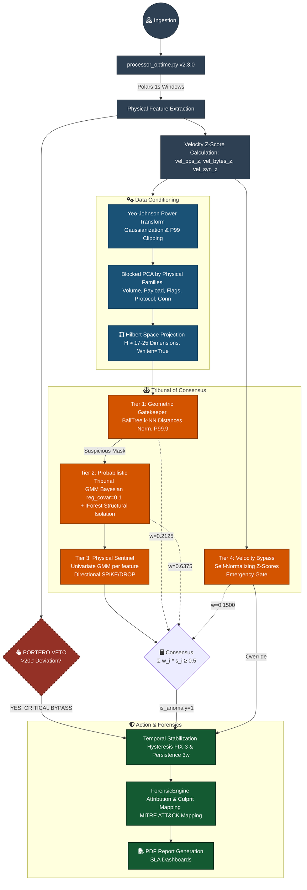
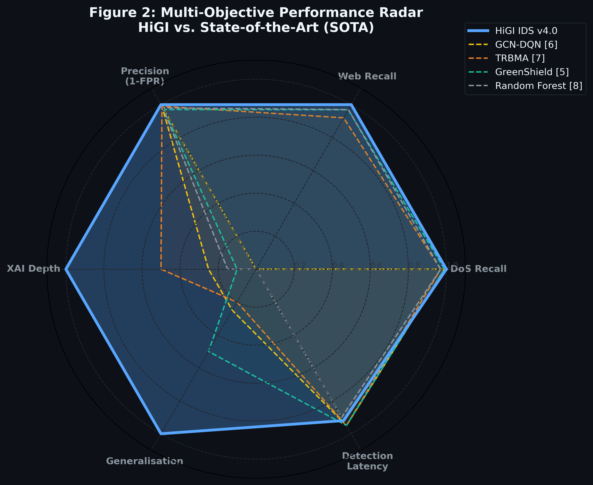

# HiGI IDS — Hilbert-space Gaussian Intelligence

> **Physics-based Network Observability:** An unsupervised Intrusion Detection System that treats network traffic as a measurable physical system — detecting threats as statistical deviations from a learned baseline, not as matched signatures.

[](https://www.python.org/)
[](./LICENSE)
[](https://peps.python.org/pep-0008/)
[](./reports/benchmarks/)

---

## Table of Contents

- [Philosophy](#philosophy)
- [Core Detection Architecture](#core-detection-architecture)
- [Performance at a Glance](#performance-at-a-glance)
- [Benchmark Results](#benchmark-results)
- [Technical Stack](#technical-stack)
- [Project Structure](#project-structure)
- [Documentation & Manuals](#documentation--manuals)
- [Quickstart](#quickstart)
- [Docker Quickstart](#docker-quickstart)
- [Pipeline Execution Showcase](#pipeline-execution-showcase)
- [Forensic Engine & XAI](#forensic-engine--xai)
- [Configuration Reference](#configuration-reference)
- [Development Standards](#development-standards)
- [Known Research Gaps & Limitations](#known-research-gaps--limitations)
- [License](#license)

---

## Philosophy

Traditional Intrusion Detection Systems operate on a **signature catalog**: a curated list of known-bad patterns. This model is fundamentally reactive — it can only identify what it has already seen. Against novel vectors, slow-rate attacks, or protocol abusers that stay within byte-volume thresholds, signature-based systems are blind.

HiGI takes a different approach. Instead of asking "does this traffic match a known attack?", it asks: "Is this traffic statistically consistent with the normal physiology of this network?"

Network flows are treated as multi-dimensional physical observables — velocity, payload continuity, connection kinematics, protocol ratios — and projected into a reduced metric space where anomaly detection becomes a geometric and probabilistic problem.   
We call this reduced space "Hilbert space" as a nod to quantum mechanics([why?](docs/reference/hilbert_disclaimer.md)). In practice, it is a finite-dimensional Euclidean space obtained via Blocked PCA with whitening, where Euclidean distance approximates the Mahalanobis distance from the baseline — making σ‑deviations geometrically meaningful.  
Anomalies are measured in standard deviations (σ) from a learned baseline: a unit that is physically interpretable and threshold-agnostic across different network environments.

### The Tribunal of Consensus

No single detector is infallible. HiGI's detection pipeline is organized as a **four-tier Tribunal of Consensus**, where each tier contributes a weighted vote. An anomaly is confirmed only when the weighted consensus score exceeds a configurable threshold (`tribunal.consensus_threshold`). This architecture prevents single-point failures, reduces false positive rates from transient spikes, and provides a structured audit trail for each detection decision.

The five **Physics Feature Families** that HiGI monitors, derived directly from the feature engineering pipeline:

| Family | Physical Analogy | Example Features |
|---|---|---|
| **Volume** | Fluid flow rate | `bytes`, `pps`, `bytes_per_second` |
| **Payload** | Signal content density | `payload_continuity_ratio`, `payload_bytes` |
| **Flags** | Protocol state signals | `flag_syn_ratio`, `flag_rst_ratio`, `icmp_ratio` |
| **Protocol** | Transport-layer vital signs | `tcp_ratio`, `udp_ratio`, `protocol_entropy` |
| **Connection** | Network kinematics | `unique_dst_ports`, `iat_mean`, `iat_std` |

Anomalies are expressed in standard deviations (σ) from the baseline — a unit that is **physically interpretable** and threshold-agnostic across different network environments.

---

## Core Detection Architecture


HiGI's detection pipeline consists of four tiers, each addressing a distinct region of the anomaly space.

**Data Conditioning:** Network physics data is inherently non-Gaussian and heavy-tailed. HiGI applies a Yeo-Johnson Power Transform to stabilize variance and minimize skewness across all feature families before Hilbert projection. This ensures that the σ-deviations computed by the Physical Sentinel are statistically valid and comparable.

### Tier 1 — BallTree Nearest-Neighbor Detector

Models the baseline as a BallTree in the reduced space. Windows with k‑NN distance (k=5) beyond the P99.9 percentile of the baseline distribution are flagged. Excels at detecting population‑level deviations.

### Tier 2A — Bayesian Gaussian Mixture Model (GMM) Detector

Scores windows by log‑likelihood under a Bayesian Gaussian Mixture Model learned on the baseline. Captures distributional shifts invisible to distance‑based methods.

### Tier 2B — Isolation Forest Detector

Ensemble of 100 trees that isolates anomalies through random partitioning. Robust against high‑dimensional outliers.

### Tier 3 — Physical Sentinel (Univariate Z-Score Auditor)

Per‑feature univariate GMM scoring on the original physical families. Tracks directionality (SPIKE/DROP) for XAI attribution. A Portero veto mechanism forces CRITICAL severity on any window with a single‑feature deviation exceeding 20σ.


### Tier 4 — Velocity Bypass Detector (Emergency Gate)

Rolling Z‑score gate on packet rate, byte rate, and SYN ratio (60 s window). Detects flash floods and volumetric spikes that are geometrically close to high‑load benign traffic in the reduced space. This tier was introduced to resolve a documented blind spot: high‑rate homogeneous floods (DoS Hulk, GoldenEye) that collapse intra‑window variance and become invisible to the BallTree.

---

## Performance at a Glance

HiGI is evaluated on the [**CIC‑IDS2017**](https://www.unb.ca/cic/datasets/ids-2017.html) dataset across three days: Monday (benign control), Wednesday (DoS/DDoS), and Thursday (Web Attacks / Infiltration). The model is trained once on Monday benign traffic and deployed without retraining on the subsequent days.

### Incident‑Level Metrics (Full Multi‑Day Evaluation)

| Metric | Value | Notes |
|---|---|---|
| **Precision** | **1.000**  | 0 reportable incidents on 8 h of Monday benign traffic |
| **Recall** | **0.875-1.000** | 7 of 8 observable attack classes detected; 1 ambiguous due to sensor data drop |
| **F1-Score** | **0.933 (conservative)**  | If the ambiguous case is counted as FN |
| **False Positive Rate** | **0.000** at incident level | 266 sub‑threshold transients correctly suppressed |
| **Detection Latency** | **≤ 1 min**  | Including slow‑rate attacks (Slowloris, Slowhttptest) |
| **Extra‑GT Reconnaissance** | **21 min pre‑attack** | Scanning detected before the first labelled DoS |

>**Important**: Precision and FPR are reported at the incident level (clusters of consecutive anomalous windows), not at the individual window level. The Monday control day produced zero reportable incidents, validating the Tribunal's false‑positive suppression. For a full derivation of all metrics, a detailed comparison with six published SOTA systems, and an honest treatment of limitations, see the [Master Benchmark Report](/reports/benchmarks/HiGI_IDS_Master_Benchmark_SoTA_Report.md).

### Comparative Multi-Objective Analysis
While supervised SOTA models such as **GCN‑DQN** (Mwiga et al., 2026) or **TRBMA** (Guo & Xie, 2025) achieve high recall on known attack classes, they require labelled attack data for training and do not optimise for generalisation under distribution shift. The radar chart below contextualises HiGI’s performance across six axes — including XAI depth and zero‑shot generalisation — where physics‑based detection offers structural advantages over supervised classifiers.

<p align="center">
  
  <br>
  <i>Figure: Multi-objective comparison across six performance axes.</i>
</p>

> **Key Insight:** HiGI and supervised SOTA are architecturally optimizing for different requirements. HiGI provides a **"Forensic-First"** detection that remains robust under distribution shifts where black-box models require constant re-calibration.

---

## Benchmark Results

HiGI has been validated against the **CIC-IDS2017 benchmark dataset** (Wednesday and Thursday sessions). Full audit reports are available in [`reports/benchmarks/`](./reports/benchmarks/).

**Dataset Source:** Experiments conducted using the [CIC-IDS2017 Dataset](https://www.unb.ca//cic/datasets/ids-2017.html) (University of New Brunswick).  Analysis scoped to victim host **192.168.10.50** (Ubuntu Server).


### CIC-IDS2017 Wednesday — DoS/DDoS Campaign (Example)

| Attack Vector | Ground Truth Window | HiGI Detection | Confidence | Dominant Physical Signature |
|---|---|---|---|---|
| DoS Slowloris | 09:47 – 10:10 EDT | ✅ MATCH (+1 min) | 100% | `unique_dst_ports` ↑ 45.84σ · Socket Exhaustion |
| DoS Slowhttptest | 10:14 – 10:35 EDT | ✅ MATCH (+1 min) | 100% | `icmp_ratio` ↑ 102.77σ · Server Saturation |
| DoS Hulk | 10:43 – 11:00 EDT | ✅ MATCH | 94.9% | `payload_continuity_ratio` ↑ 1,917σ · Volume Flood |
| DoS GoldenEye | 11:10 – 11:23 EDT | ✅ MATCH | 93.5% | `payload_continuity_ratio` ↑ 4,120σ · Keepalive Collapse |

**Pre-Attack Reconnaissance Detected (Extra-GT):** HiGI flagged anomalous scanning activity at 09:26 EDT — **21 minutes before the first labeled attack** — mapping to MITRE ATT&CK T1046 (Network Service Discovery) and T1595.001 (Active Scanning). This phase is invisible to supervised models trained exclusively on attack labels.

### Summary Performance Metrics (Wednesday)

| Metric | Value |
|---|---|
| Recall (TPR) | **100%** — all 4 DoS vectors detected |
| False Negatives | **0** |
| Detection Latency | **≤ 1 minute** (including slow-rate attacks) |
| Reportable False Positives | 0 (5 sub‑threshold transients; 2 confirmed as reconnaissance, 3 suppressed by filters) |


---

## Technical Stack

```
Python          3.11+
scikit-learn    ≥ 1.4      # BallTree, GMM, IsolationForest, PowerTransformer (Yeo-Johnson)
polars          ≥ 0.20     # Lazy, memory-efficient PCAP-to-feature pipeline
dpkt                       # PCAP ingestion and packet-level parsing
PyYAML          ≥ 6.0      # Configuration loading (config.yaml → HiGISettings dataclass)
numpy           ≥ 1.26
pandas          ≥ 2.0      # Supplementary tabular operations
matplotlib      ≥ 3.8      # Forensic timeline and radar chart generation
reportlab                  # Forensic PDF report generation
```

All configurable parameters — thresholds, sigma values, PCA variance targets, window sizes — are defined exclusively in `config.yaml`. **The source code contains zero magic numbers.**

---

## Project Structure

```
HiGI/
│
├── config.yaml                         # Central configuration (Single Source of Truth)
├── main.py                             # CLI entry point (train / detect / report)
│
├── Dockerfile                          # Docker image definition
├── docker-compose.yml                  # Docker Compose service definition
├── requirements.txt                    # Python dependencies
│
├── README.md                           # Project overview and documentation
├── LICENSE                             # MIT License
│
├── DEMO_NOTEBOOK.ipynb                 # End‑to‑end pipeline demo notebook
│
├── data/                               # Runtime data (ignored by Git)
│   ├── raw/                            #   Input PCAP files (CIC‑IDS2017, CIC‑IDS2019 …)
│   └── processed/                      #   Detection results (.csv / .json)
│
├── models/                             # Trained artifacts 
│   ├── *.pkl, *.json                   #   Serialized ArtifactBundles & sidecars
│   └── scalers/                        #   Fitted RobustScaler objects
│
├── reports/                            # Generated evidence (committed for traceability)
│   ├── benchmarks/                     #   CIC‑IDS2017 validation reports & figures
│   ├── forensic_monday/                #   Forensic report — Monday (benign control)
│   ├── forensic_wednesday/             #   Forensic report — Wednesday (DoS/DDoS)
│   └── forensic_thursday/              #   Forensic report — Thursday (Web Attacks)
│
├── logs/                               # Rotating operational logs (ignored by Git)
│
├── docs/                               # Technical manuals (English & Spanish)
│   ├── eng/                            #   English versions
│   ├── esp/                            #   Spanish versions
│   └── reference/                      #   Hilbert disclaimer & engine references
│
└── src/                                # Source code
    ├── config.py                       #   HiGISettings dataclass + YAML validation
    ├── orchestrator.py                 #   Top‑level pipeline orchestrator
    ├── utils/                          #   Preflight, BLAS threads & joblib configuration
    ├── ingestion/
    │   ├── __init__.py
    │   └── processor_optime.py         #   Polars lazy PCAP‑to‑feature pipeline
    ├── models/
    │   ├── __init__.py
    │   └── higi_engine.py              #   Hilbert Projector + 4‑Tier Tribunal engine
    └── analysis/
        ├── __init__.py
        └── forensic_engine.py          #   XAI report generation & MITRE mapping
```

> **Note:** The `data/raw/` and `logs/` folders are ignored by Git. The structure above shows what a fully operational local copy looks like after running the pipeline.


---

## Documentation & Manuals

HiGI provides comprehensive documentation for different SOC roles. Available in **English** and **Spanish**.

| Role / Manual | Description | Language | Link |
|---|---|---|---|
| **Forensic Analyst Guide** | XAI attribution, MITRE mapping & incident triage | 🇺🇸 ENG · 🇪🇸 ESP | [`docs/`](./docs) |
| **Data Engineering Ref.** | Polars pipeline, feature physics & ingestion | 🇺🇸 ENG · 🇪🇸 ESP | [`docs/`](./docs) |
| **Engine Architecture** | Hilbert Projector, GMM & Tribunal logic | 🇺🇸 ENG · 🇪🇸 ESP | [`docs/`](./docs) |
| **Orchestrator & Execution** | Training, detection, reporting lifecycle; CLI reference; ArtifactBundle & configuration contracts | 🇺🇸 ENG · 🇪🇸 ESP | [`docs/`](./docs) |


---

## Quickstart

### Prerequisites

```bash
python -m venv ids_env
source ids_env/bin/activate          # Linux / macOS
# ids_env\Scripts\activate           # Windows

pip install -r requirements.txt
```

### 1. Train a Baseline

```bash
python main.py train  --source data/raw/Monday.pcap     --bundle models/baseline.pkl
```

### 2. Run Detection

```bash

python main.py detect \
  --source data/raw/Wednesday_Victim_50.pcap \
  --bundle models/baseline.pkl
```

Output: per‑window anomaly scores (`.csv`) and structured incident log (`.json`).

### 3. Generate a Forensic Report

```bash
python main.py report \
   --results data/processed/wednesday_results.csv  \
   --bundle models/baseline_model.pkl \
   --output-dir reports/forensic_wednesday/ 
```
Generates a Markdown report and a PDF report with incident timeline, MITRE ATT&CK mapping, and physical stress radar charts.

---

## Docker Quickstart

HiGI ships with a [`Dockerfile`](/Dockerfile) that lets you run the full pipeline inside a container — no Python environment needed beyond Docker itself.

### What are the volumes for?

HiGI reads and writes files in three places: PCAPs and results live in `data/`, the trained model is stored in `models/`, and forensic reports land in `reports/`. The container does not bundle any of this; you mount your local copies so everything persists on your machine after the container exits. That is what the `-v $(pwd)/data:/app/data` flags do: they map a folder on your host (left side) into the container (right side).

### Build the image

```bash
docker build -t higi-ids .
```
### 1. Train a Baseline
```bash
docker run --rm \
  -v $(pwd)/data:/app/data \
  -v $(pwd)/models:/app/models \
  higi-ids train \
  --source data/raw/Monday.pcap \
  --bundle models/baseline.pkl
  ```

  ### 2. Run Detection
  ```bash
  docker run --rm \
  -v $(pwd)/data:/app/data \
  -v $(pwd)/models:/app/models \
  higi-ids detect \
  --source data/raw/Wednesday_Victim_50.pcap \
  --bundle models/baseline.pkl
  ```

  ### 3. Generate a Forensic Report
  ```bash
  docker run --rm \
  -v $(pwd)/data:/app/data \
  -v $(pwd)/models:/app/models \
  -v $(pwd)/reports:/app/reports \
  higi-ids report \
  --results data/processed/Wednesday_Victim_50_results.csv \
  --bundle models/baseline.pkl \
  --output-dir reports/wednesday
  ```
  The report (PDF + Markdown + `.png`) is written to `reports/wednesday/`.

  ### Optional: use docker‑compose

  ```yaml
# docker-compose.yml
services:
  higi:
    build: .
    volumes:
      - ./data:/app/data
      - ./models:/app/models
      - ./reports:/app/reports
      - ./config.yaml:/app/config.yaml:ro
    working_dir: /app
    entrypoint: ["tini", "--", "python", "main.py"]
  ```
  Build the image with (you can download the [`docker-compose.yml`](/docker-compose.yml)):
  ```bash
docker-compose build
  ```
  Then run any command with:
  ```bash
# Train
docker-compose run --rm higi train --source data/raw/Monday.pcap --bundle models/baseline.pkl

# Detect
docker-compose run --rm higi detect --source data/raw/Wednesday_Victim_50.pcap --bundle models/baseline.pkl

# Report
docker-compose run --rm higi report --results data/processed/Wednesday_Victim_50_results.csv --bundle models/baseline.pkl --output-dir reports/wednesday
  ```
>Note: The image contains no PCAPs and no pre‑trained models. You need to provide your own captures and mount them as shown above.

---


##  Pipeline Execution Showcase

For a pre-rendered, step-by-step walkthrough of the **HiGI Engine** in action, refer to the [Demo Notebook](DEMO_NOTEBOOK.ipynb). 

This showcase captures a real-world execution of the full pipeline—from model training to forensic anomaly reporting—allowing you to audit the physical logic and internal logs without the need for a local environment setup or large PCAP datasets.

> Note: The execution shown is optimized for traffic originating from the .50 host at [CIC-IDS2017](https://www.unb.ca/cic/datasets/ids-2017.html) as defined in the project's baseline.

---

## Forensic Engine & XAI

Every confirmed incident produces a structured **forensic autopsy** — not a binary alarm label. The Forensic Engine ([`src/analysis/forensic_engine.py`](/src/analysis/forensic_engine.py)) generates:

### Physical Stress Attribution

For each incident, the engine identifies the **culprit physical family** and the specific features driving the anomaly, ranked by their σ-deviation from baseline. Example output for DoS Slowloris:

```
Incident #29 | 09:48 – 10:11 EDT | Confidence: 100%
  Physical Signature:
    [CONNECTION]  unique_dst_ports   +45.84σ  (SPIKE)   → Socket Exhaustion
    [FLAGS]       flag_syn_ratio     +9.8σ    (SPIKE)   → Semi-open connection flood
  MITRE ATT&CK:  T1499.001 (OS Exhaustion Flood)
  Tribunal Verdict: CRITICAL | BallTree ✅ | GMM ✅ | IForest ✅ | Sentinel ✅
```

### MITRE ATT&CK Mapping

Each incident is automatically mapped to the closest MITRE ATT&CK technique based on the dominant physical family and directionality profile. Ambiguous cases are flagged for analyst review.

### Forensic Report Artifacts

| Artifact | Format | Description |
|---|---|---|
| Incident Timeline | PNG | Temporal distribution of anomaly scores with severity bands |
| Physical Radar | PNG | Per-family σ-deviation in polar coordinates across incidents |
| Forensic Report | Markdown | Full narrative autopsy with XAI attribution |
| Forensic Report | PDF | Print-ready version for SOC documentation |

Reports are filtered by `sigma_culprit_min: 2` (configurable).
<p align="center">
  
   
  <br>
  <i>Physical Radar and Incident Timeline for the Wednesday DoS/DDoS campaign.</i>
</p>

---

## Configuration Reference

The complete parameter surface is documented inline in `config.yaml`. Key sections:

| Section | Purpose |
|---|---|
| `paths` | I/O directory layout |
| `ingestion` | Chunk size, parallelism, aggregation window |
| `training` | Baseline augmentation (Gaussian noise, 5% scale, 10% fraction) |
| `hilbert` | Blocked PCA variance targets per family (Volume: 95%, Payload: 99%, Flags: 99%, Protocol: 99%, Connection: 95%) |
| `balltree` | k-NN detector thresholds (P90 → P99.9) and slack |
| `gmm` | Bayesian GMM parameters, adaptive K range, score normalization |
| `iforest` | Contamination factor and estimator count |
| `sentinel` | Per-feature LL thresholds, directionality tracking, Portero veto |
| `velocity` | Velocity bypass Z-score gate and severity mapping |
| `tribunal` | Consensus weights and decision threshold |
| `family_consensus` | Co-firing requirement for borderline escalation |
| `persistence` | Hysteresis, warmup, moving average window, anti-FP rolling filter |
| `forensic` | Debounce, sigma filter, confidence filter, MITRE attribution |

---

## Development Standards

HiGI is developed to professional open-source standards suitable for research publication, SOC integration, and community contribution.

- **Style:** PEP 8 enforced throughout all source modules.
- **Type Safety:** Full static type hinting on all public interfaces.
- **Documentation:** Google‑style docstrings on all public classes and methods.
- **Configuration:** Zero magic numbers — all parameters in `config.yaml`, validated at startup.
- **Language:** English‑only source code, comments, docstrings, and commit messages.
- **Modularity:** Ingestion, model, analysis, and orchestration layers are independently testable and replaceable.

---

## Known Research Gaps & Limitations

HiGI is designed for **honest engineering**. The following limitations are documented transparently:

### What HiGI Does Not Detect (Out of Scope)

**Application‑Layer Semantic Attacks (SQLi, XSS, Command Injection)**. HiGI models the physical structure of traffic (bytes, timing, connection geometry), not the semantic content of payloads. A SQL injection that fits within normal byte volumes will not produce a detectable σ‑deviation. Detection of semantic attacks requires a separate payload inspection engine at Layer 7.

**Operational Deployment Caveats**

* **Stationary baseline dependency**. The system requires a baseline PCAP representative of normal operation. High day‑to‑day variability (diurnal patterns, flash crowds) will elevate false positive rates until dynamic baseline normalisation is implemented (planned for v5.0).

* **Encrypted traffic**. Payload‑family features degrade under TLS, though connection, volume, and flag features remain fully observable.

* **Data‑drop sensor gaps**. Packet‑capture drops during extreme floods create telemetry gaps. HiGI detects and flags these, but anomaly scoring within gaps is incomplete. The Velocity Bypass (Tier 4) is the primary compensating mechanism.

* **Prolonged attack calibration**. During extended attacks (>30 min), feature drift may understate severity. The debounce_seconds: 30 clustering window partially mitigates this.

### What HiGI Does Well

- **Zero-day and novel attack detection** — no signature catalog means no blind spots for previously unseen attack mechanics
- **Slow-rate attack sensitivity** — Slowloris detected at 45.84σ in `unique_dst_ports`  despite negligible byte volume, a known failure mode for supervised ML models.
- **Pre-attack reconnaissance detection** — scanning and discovery phases are visible as connection‑family anomalies before any destructive payload is sent.
- **Interpretable forensic output** — every alert includes a physical culprit (feature + σ-deviation + directionality), enabling analyst triage without black-box trust
- **Unsupervised operation** — only a clean baseline PCAP is required for deployment; no labelled attack data is needed.
- **100% Recall on CIC-IDS2017 DoS/DDoS campaigns** with ≤ 1 minute detection latency
- **0 reportable false positives on 8 hours of benign control traffic (266 sub‑threshold transients suppressed)** (Monday session).

### Validation Scope

All metrics reported in this README are derived from the CIC‑IDS2017 dataset. While this is the most widely cited benchmark in IDS literature, it has known limitations (synthetic background traffic, repetitive patterns). Validation on additional datasets (CIC‑IDS2019, UNSW‑NB15) and live network traffic is the next step in the research roadmap. See the [Master Benchmark Report](/reports/benchmarks/HiGI_IDS_Master_Benchmark_SoTA_Report.md) for an extended discussion.

---

## Future Roadmap: From Static Forensic to Real-Time Action


- **Live Ingestion Bridge:** `scapy.sniff` or `AF_PACKET` socket for sub‑second real‑time feature extraction.

- **Dynamic Thresholding (v5.0):** Sliding‑window baseline to handle non‑stationary network behaviour.

- **Automated Response (Action Tier):** Integration with `iptables`/`nftables` to null‑route sources that trigger the Portero Veto (>20σ).

- **Multi‑dataset validation:** CIC‑IDS2019, UNSW‑NB15, and live network pilots.

---

## License

MIT License — see [`LICENSE`](./LICENSE) for full terms.

---

*HiGI IDS — Created and Developed by Pablo Aguadero, 2026. Built with the assistance of free-tier AI tools (Gemini, Claude, Copilot) for architectural iteration, code review, and documentation drafting. All design decisions, physical models, and validation protocols are original work by the author.*
*Validated against CIC-IDS2017. Reference: Engelen, G., Rimmer, V., & Joosen, W. (2021). Troubleshooting an Intrusion Detection Dataset: the CICIDS2017 Case Study. IEEE EuroS&PW. doi:10.1109/EuroSPW54576.2021.00015*
