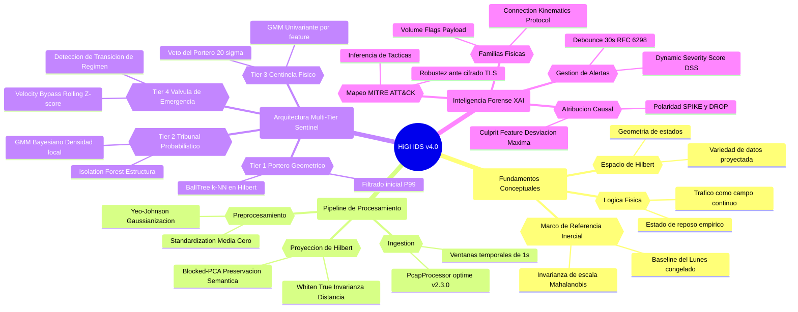

# HiGI IDS v4.0: Hilbert-space Gaussian Intelligence
> **A Physics-Inspired Intrusion Detection System based on Manifold Learning & Kinetic Regime Analysis.**

## 🌌 ABSTRACT: Hilbert-space Gaussian Intelligence

### Contexto y Fundamentos de Lógica Física
**HiGI IDS v4.0** propone un cambio de paradigma en la detección de intrusiones en red (NIDS), abandonando el análisis heurístico por un enfoque de **Lógica Física**. El sistema postula que el tráfico de red puede ser modelado como un sistema físico continuo caracterizado por variables de estado como **presión (PPS)**, **volumen (bytes)** y **composición (flags/protocolos)**. Bajo esta premisa, el tráfico legítimo no se define mediante reglas, sino como un **campo de equilibrio estadístico** donde las intrusiones actúan como fuerzas externas que inducen perturbaciones cinemáticas en el estado de reposo del sistema.

### Marco de Referencia Inercial
Central a esta arquitectura es el concepto de **Marco de Referencia Inercial** ($\mathcal{N}(\boldsymbol{\mu}_0, \boldsymbol{\Sigma}_0)$), construido empíricamente a partir de un baseline de tráfico benigno estacionario (e.g., Lunes). Durante la fase de entrenamiento, el motor calibra los parámetros estadísticos que definen el reposo y los congela para evitar el **reference poisoning** por ataques persistentes. Toda muestra de inferencia se evalúa exclusivamente como una desviación respecto a este marco inercial, permitiendo que la detección sea **invariante ante la escala** y dependiente únicamente de la **distancia de Mahalanobis** en el espacio original.

### Proyección al Espacio de Hilbert ($\mathcal{H}$)
Para resolver la alta dimensionalidad y la naturaleza no lineal del tráfico (distribuciones log-normales y bimodales), HiGI implementa una proyección a una variedad de datos reducida denominada **Espacio de Hilbert**. El pipeline de preprocesamiento aplica una transformación de **Yeo-Johnson** seguida de un **Análisis de Componentes Principales (PCA) con blanqueamiento (whitening)**. Este proceso garantiza que la varianza sea unitaria en todas las dimensiones proyectadas, logrando que la distancia euclidiana en $\mathcal{H}$ sea un estimador fiel de la disimilitud semántica y equivalga matemáticamente a la distancia de Mahalanobis.

---

## 🏗️ Arquitectura de Detección en Cascada (Multi-Tier Sentinel)

HiGI v4.0 opera mediante una estructura de detección de cuatro niveles independientes y coordinados, optimizados para el rigor estadístico y la eficiencia computacional.

| Nombre del Tier | Base Matemática | Función Crítica | Hito Técnico (Breakthrough) |
| :--- | :--- | :--- | :--- |
| **Tier 1: Portero Geométrico** | BallTree (k-NN) en Espacio de Hilbert | Filtrado inicial de muestras basado en la proximidad geométrica. | **FIX-1 (Batch-Independence):** Normalización de scores contra el percentil P99 de entrenamiento para invarianza de escala. |
| **Tier 2: Tribunal Probabilístico** | Bayesian GMM + Isolation Forest | Estimación de la densidad de probabilidad local y aislamiento estructural. | **Selección Adaptativa de K:** Voto ponderado (BIC/AIC/Sil/DB) para evitar sobreajuste a artefactos de red. |
| **Tier 3: Centinela Físico** | GMM Univariante por característica | Verificación de plausibilidad física en cada dimensión marginal independiente. | **Portero Veto:** Capacidad de forzar alerta crítica incondicional si una métrica supera $\sigma \geq 20.0$. |
| **Tier 4: Válvula de Emergencia** | Rolling Z-score (PPS, Bytes, SYN) | Detección de transiciones abruptas de régimen dinámico "geométricamente invisibles". | **Velocity Bypass:** Operación apátrida (*stateless*) fuera de Hilbert que protege la alerta contra filtros de supresión. |

### Notas Técnicas de Implementación
* **Mecanismo de Cortocircuito:** El sistema optimiza el cómputo enviando al Tier 2 solo las muestras fuera de la zona de confort (P90) del Tier 1, excepto en el **Tier 4**, que evalúa el 100% de la telemetría en paralelo.
* **Consenso del Tribunal:** La decisión final integra las señales mediante una suma ponderada donde el **GMM (0.280)** y el **Velocity Bypass (0.300)** poseen la mayor influencia.
* **Protección de Persistencia:** Las alertas de Tier 4 se re-aplican tras los filtros de suavizado temporal (*rolling-min*), impidiendo que ataques DoS explosivos sean silenciados.

---

## 🕵️ Forensic Intelligence & Explainable AI (XAI)

El motor **ForensicEngine V2** descompone desviaciones matemáticas complejas en métricas físicas comprensibles para el analista del SOC.

### 1. Lógica del Culpable Primario (Culprit Feature)
Identifica la característica $j^*$ que presenta la mayor desviación absoluta ($|\sigma|$) en el instante $t$.
* **Sparsidad Adversarial:** Postula que un ataque impacta con mayor fuerza en un subconjunto específico de dimensiones físicas.
* **Ranking y Loading:** Las desviaciones se normalizan en un *Loading Magnitude* (0 a 1). Un loading de 1.0 identifica al feature con la desviación máxima, generando un ranking de los **Top-3 culpables físicos**.
* **Resolución de Conflictos:** Prioriza al Tier 3 (Physical Sentinel) por su máxima resolución espacial.

### 2. Análisis de Polaridad: SPIKE vs. DROP
* **SPIKE (Sgn = +1):** Valor significativamente superior al baseline (e.g., SYN Flood o Exfiltración).
* **DROP (Sgn = -1):** Valor inferior a la media del baseline (e.g., inundación masiva bajando el *iat_mean*).
* **Detección de Aleatoriedad:** Ataques de Fuerza Bruta producen SPIKES extremos (decenas de miles de sigmas) en `payload_continuity_ratio`.

### 3. Agrupación Temporal y Lógica de De-bounce (RFC 6298)
* **Reducción de Fatiga:** Consolida ventanas anómalas en un único objeto **SecurityIncidentV2** si los gaps son < 30 segundos.
* **Alineación Estándar:** El parámetro de 30s se alinea con los tiempos máximos de retransmisión TCP del **RFC 6298**.
* **Persistencia:** Permite distinguir entre *Sustained Attack* y *Transient Spike*.

---

## 📊 Benchmarks de Validación: CIC-IDS-2017

### 1. Hallazgos Principales por Jornada
* **Wednesday (DoS/DDoS):** Recall del **100%**. Detectó **Slowloris** ($45.84\sigma$) y **GoldenEye** ($4120\sigma$). Identificó fases de reconocimiento 21 minutos antes de la etiqueta oficial.
* **Thursday (Web/Infiltración):** Detección exitosa de Brute Force ($38,836\sigma$), XSS y **Nmap** (identificado por flags URG con desviación astronómica de **$216,195\sigma$**).

### 2. La Paradoja de Hulk: Tier 1 vs. Tier 4
Ataques como **DoS Hulk** son "geométricamente invisibles" para el Espacio de Hilbert debido a su baja varianza intra-ventana (score de apenas 0.26×P99 en Tier 1).
* **Solución:** El **Tier 4 (Velocity Bypass)** interceptó a Hulk (Incidente #36) detectando la presión estadística por la multiplicación brutal de PPS, logrando un match con **94.9% de confianza**.

### 3. Eficiencia Operacional (Reducción de Fatiga)
| Jornada | Ventanas Anómalas | Incidentes Reportables | Ratio de Manejabilidad |
| :--- | :--- | :--- | :--- |
| **Wednesday** | 3,599 | 9 | **0.25%** |
| **Thursday** | 3,954 | 10 | **0.25%** |

---
*Documentación generada bajo estándares internacionales de Open Source para el proyecto HiGI IDS v4.0.*
