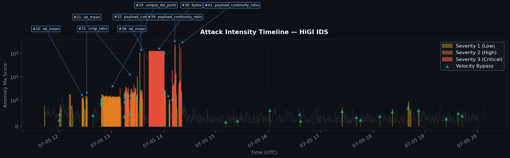
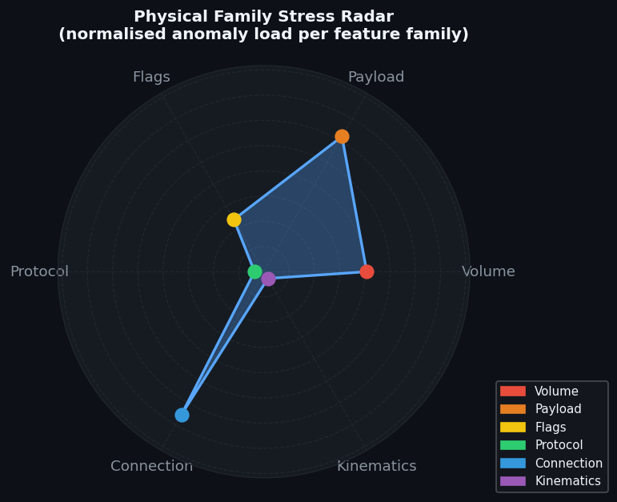

# HiGI IDS — Manual de Inteligencia Forense y Atribución (XAI)

**Versión:** 2.0.0 · **Motor:** `forensic_engine.py` · **Ecosistema:** HiGI IDS v4.0  
**Clasificación:** Documentación Técnica Interna — Equipo SOC / Blue Team  
**Formato de referencias:** IEEE / MITRE ATT&CK v14

---

## Tabla de Contenidos

1. [Fundamentos de la Atribución Forense](#1-fundamentos-de-la-atribución-forense)
2. [Lógica del Culpable Primario (Culprit Feature)](#2-lógica-del-culpable-primario-culprit-feature)
3. [Análisis de Polaridad y Eventos: SPIKE vs. DROP](#3-análisis-de-polaridad-y-eventos-spike-vs-drop)
4. [Taxonomía de Familias Físicas](#4-taxonomía-de-familias-físicas)
5. [Mapeo Táctico MITRE ATT&CK](#5-mapeo-táctico-mitre-attck)
6. [Agrupación y Persistencia — Debounce Logic](#6-agrupación-y-persistencia--debounce-logic)
7. [Métricas de Severidad Dinámica (DSS)](#7-métricas-de-severidad-dinámica-dss)
8. [Interpretación de Evidencia Visual](#8-interpretación-de-evidencia-visual)
9. [Glosario de Términos Técnicos](#9-glosario-de-términos-técnicos)

---

## 1. Fundamentos de la Atribución Forense

### 1.1 El Problema Central: De Matemática a Inteligencia

Un detector de anomalías produce, en su forma más elemental, una respuesta binaria: _normal_ o _anómalo_. Este output es matemáticamente correcto pero operacionalmente inútil para un analista de SOC. La pregunta crítica no es _"¿hay una anomalía?"_ sino _"¿qué característica física del tráfico ha cambiado, en qué dirección, con qué magnitud, y a qué táctica adversaria corresponde?"_

El `ForensicEngine V2` de HiGI resuelve este problema mediante un pipeline de atribución causal en cuatro etapas:

```
Anomalía matemática (σ > umbral)
        ↓
Identificación del feature culpable (máximo |σ| ponderado)
        ↓
Clasificación por familia física (Flags / Volume / Payload / ...)
        ↓
Mapeo táctico MITRE ATT&CK (táctica + técnica)
```

### 1.2 El Marco de Referencia Inercial del Tráfico

En mecánica clásica, un *marco de referencia inercial* es aquel en el que las leyes de Newton son válidas: un objeto en reposo permanece en reposo a menos que actúe sobre él una fuerza externa. En el análisis forense de HiGI, el **baseline de lunes** (tráfico de oficina sin ataques) constituye el equivalente exacto de ese marco inercial.

Formalmente, sea $\mathbf{x}_t \in \mathbb{R}^d$ el vector de características físicas del tráfico en la ventana temporal $t$, y sea $\mathcal{N}(\boldsymbol{\mu}_0, \boldsymbol{\Sigma}_0)$ la distribución del baseline, donde $\boldsymbol{\mu}_0$ y $\boldsymbol{\Sigma}_0$ son la media y la covarianza estimadas durante el entrenamiento sobre el día lunes.

**Definición — Marco de Referencia Inercial del Tráfico:**

> El sistema de referencia inercial es la distribución $\mathcal{N}(\boldsymbol{\mu}_0, \boldsymbol{\Sigma}_0)$ del tráfico de baseline. En ausencia de perturbaciones adversariales, el tráfico observado $\mathbf{x}_t$ es un punto muestral de esta distribución. Un ataque actúa como una **fuerza externa** que desplaza $\mathbf{x}_t$ fuera de la región de alta densidad de la distribución de referencia.

La magnitud del desplazamiento se mide mediante la **distancia de Mahalanobis** entre $\mathbf{x}_t$ y el centro del marco inercial:

$$D_M(\mathbf{x}_t) = \sqrt{(\mathbf{x}_t - \boldsymbol{\mu}_0)^\top \boldsymbol{\Sigma}_0^{-1} (\mathbf{x}_t - \boldsymbol{\mu}_0)}$$

Esta métrica es superior a la distancia euclídea porque está normalizada por la covarianza del baseline: una desviación de 100 bytes/s puede ser insignificante en una red de datacenter pero catastrófica en una red doméstica. La distancia de Mahalanobis es invariante ante la escala de cada feature.

### 1.3 Proyección al Espacio de Hilbert mediante Blocked PCA

Antes de llegar al motor forense, el `higi_engine.py` proyecta el vector $\mathbf{x}_t$ al **espacio de Hilbert** mediante una Blocked PCA por familias físicas. Esta proyección tiene dos efectos que son fundamentales para la atribución forense:

**Efecto 1 — Decorrelación dentro de cada familia.** Los features de una misma familia (p.ej. `bytes_in`, `bytes_out`, `pps`) están altamente correlacionados entre sí. La PCA por familia extrae las direcciones de máxima varianza (componentes principales $\mathbf{v}_k^{(f)}$) eliminando la redundancia.

**Efecto 2 — Preservación de la semántica física.** A diferencia de una PCA global, la Blocked PCA garantiza que cada componente principal $\text{PC}_k^{(f)}$ pertenece exclusivamente a la familia $f$. El motor forense puede así rastrear qué componente disparó la anomalía y mapearlo directamente a la familia física correspondiente mediante los metadatos `_blocked_pca_family_mapping`.

Formalmente, sea $\mathbf{W}^{(f)} \in \mathbb{R}^{d_f \times k_f}$ la matriz de loadings de la familia $f$. La proyección es:

$$\mathbf{z}_t^{(f)} = {\mathbf{W}^{(f)}}^\top (\mathbf{x}_t^{(f)} - \boldsymbol{\mu}_0^{(f)})$$

donde $\mathbf{x}_t^{(f)}$ es el subvector de features pertenecientes a la familia $f$. El espacio de Hilbert proyectado tiene la propiedad de que la distancia euclidea en él approxima la distancia de Mahalanobis en el espacio original.

### 1.4 La Cadena de Custodia Digital

El concepto jurídico de *cadena de custodia* exige que toda evidencia sea trazable desde su origen hasta la conclusión. El `ForensicEngine V2` implementa este principio computacionalmente: cada incidente reportado incluye el identificador del tier que disparó la alerta, el feature específico, la magnitud en $|\sigma|$, el porcentaje de cambio, la dirección (SPIKE/DROP), la familia física y la técnica MITRE. No existe ningún paso de inferencia que no sea completamente auditable.

---

## 2. Lógica del Culpable Primario (Culprit Feature)

### 2.1 Definición Matemática del Feature Culpable

Para cada ventana temporal $t$ clasificada como anómala, el `higi_engine.py` computa el **score de desviación** de cada feature $f_j$ del vector observado respecto al baseline:

$$\sigma_j(t) = \frac{x_j(t) - \mu_{0,j}}{s_{0,j}}$$

donde $\mu_{0,j}$ y $s_{0,j}$ son la media y la desviación estándar estimadas del baseline para el feature $j$-ésimo. Este es el Z-score estándar de una variable aleatoria normal.

El **feature culpable primario** de la ventana $t$ se define como:

$$j^*(t) = \arg\max_{j \in \{1,\ldots,d\}} \left| \sigma_j(t) \right|$$

Esta elección tiene una justificación estadística precisa: bajo la hipótesis de que el ataque actúa predominantemente sobre un subconjunto reducido de features (hipótesis de sparsidad adversarial), el feature con mayor desviación absoluta es el de mayor poder discriminativo, análogamente al estadístico de Portmanteau en series temporales.

La anotación resultante que el motor forense consume sigue el formato:

```
flag_syn_ratio (SPIKE (+865%), σ=4.2) | GMM: pps_acc (LL=-3.2)
```

El método `_extract_sigma()` extrae $|\sigma_j|$ mediante la expresión regular `σ\s*=\s*([\d.]+)`, y `_extract_pct()` extrae el porcentaje de cambio relativo:

$$\Delta\%(t) = \frac{x_j(t) - \mu_{0,j}}{\mu_{0,j}} \times 100$$

### 2.2 Normalización del Loading para Comparabilidad entre Incidentes

Dentro de un incidente de duración $T$ ventanas, el mismo feature puede dispararse con distintas magnitudes en cada ventana. Para producir un ranking estable, el motor agrega mediante el **máximo** (no la media) y luego normaliza:

$$\ell_j = \frac{\max_{t \in T} |\sigma_j(t)|}{\max_{j'} \max_{t \in T} |\sigma_{j'}(t)|}$$

Este $\ell_j \in [0, 1]$ es el **Loading Magnitude** del feature $j$ en el incidente, correspondiente al campo `loading_magnitude` de `FeatureAttribution`. El ranking por $\ell_j$ decreciente produce los Top-3 features del XAI.

La normalización por el máximo del incidente (y no por una constante global) tiene una consecuencia importante: el loading es **relativo al incidente**, no absoluto. Un loading de 1.0 significa que ese feature tuvo la mayor desviación de todos en ese incidente, independientemente de si $|\sigma| = 5$ o $|\sigma| = 216.000$.

### 2.3 Extracción del Nombre Base del Feature

Los anotaciones de culpable pueden contener texto adicional (tipo de evento, sigma, probabilidad GMM). El método `_extract_base_name()` implementa un parser de expresión regular:

```python
match = re.match(r"^([a-z_][a-z0-9_]*)", str(raw).strip(), re.IGNORECASE)
```

La expresión `[a-z_][a-z0-9_]*` captura el identificador Python canónico del feature (el nombre de la columna) y descarta el resto de la anotación. Esto garantiza que `flag_syn_ratio (SPIKE (+865%), σ=4.2)` se reduzca a `flag_syn_ratio`, que es la clave de búsqueda en el diccionario MITRE.

### 2.4 Resolución de Conflictos entre Tiers

Cuando múltiples tiers reportan culpables distintos (BallTree señala `bytes` mientras GMM señala `iat_mean`), el motor forense no vota: usa la columna `physical_culprit` que el orquestador embebe en el CSV, la cual es determinada por el Physical Sentinel (Tier 3) cuando está disponible, porque opera sobre features individuales y tiene la mayor resolución espacial.

---

## 3. Análisis de Polaridad y Eventos: SPIKE vs. DROP

### 3.1 Definición Formal de Polaridad

La polaridad de un evento se determina por el signo del Z-score del feature culpable en la ventana anómala:

$$\text{Polaridad}(t) = \text{sgn}\left(\sigma_{j^*}(t)\right) = \text{sgn}\left(x_{j^*}(t) - \mu_{0,j^*}\right)$$

- **SPIKE** ($\text{sgn} = +1$, $\Delta\% \gg 0$): El valor observado excede significativamente la media del baseline. El tráfico en esa dimensión es más intenso de lo esperado.
- **DROP** ($\text{sgn} = -1$, $\Delta\% < 0$): El valor observado cae significativamente por debajo de la media del baseline. El tráfico en esa dimensión es menos intenso de lo esperado.

### 3.2 Semántica Física de la Polaridad por Feature

La polaridad no es simétrica en términos de amenaza. La siguiente tabla muestra la interpretación forense correcta según el feature y la polaridad:

| Feature | SPIKE (valor > baseline) | DROP (valor < baseline) | Amenaza predominante |
|---|---|---|---|
| `iat_mean` | Conexiones irregularmente lentas / cadencia regular de C2 | Flood de alta frecuencia / saturación | Slowloris (SPIKE), DoS (DROP) |
| `payload_continuity_ratio` | Payloads completamente diferentes entre paquetes (Brute Force, fuzzing) | Payloads idénticos repetidos (loop de ataque determinista) | BF/XSS (SPIKE), replay (DROP) |
| `flag_syn_ratio` | Flood SYN / escaneo de puertos abiertos | Caída de handshakes (RST masivos bloqueando) | SYN Flood (SPIKE) |
| `flag_urg_ratio` | Nmap con flags especiales / TCP Xmas scan | — (URG nunca debería caer en baseline) | Reconocimiento activo (SPIKE) |
| `bytes` | Ataque volumétrico / exfiltración masiva | Canal covert de bajo ancho de banda | DoS Hulk (SPIKE), Beaconing (DROP) |
| `unique_dst_ports` | Port scan / socket exhaustion | Acceso concentrado en un único servicio | Reconocimiento (SPIKE) |
| `icmp_ratio` | ICMP flood / ping sweep / respuestas de error del servidor | Bloqueo ICMP por firewall tras ataque | DoS ICMP (SPIKE), efecto secundario (SPIKE) |

### 3.3 El Caso Asimétrico: `iat_mean` como Detector Bidireccional

El feature `iat_mean` (inter-arrival time medio entre paquetes) es el ejemplo más instructivo de la asimetría semántica de la polaridad:

**SPIKE en `iat_mean`:** El tiempo medio entre paquetes sucesivos es mayor de lo normal. Físicamente, esto significa que los paquetes llegan más despacio. Un atacante que ejecuta Slowloris o Slowhttptest mantiene conexiones HTTP abiertas enviando una cabecera por vez, con pausas deliberadas de varios segundos entre ellas. Desde la perspectiva del servidor víctima, el `iat_mean` aumenta dramáticamente respecto al tráfico de oficina (donde los usuarios navegan continuamente). En el incidente #12 del [jueves](../reports/forensic_thursday/Thursday_Victim_50_results_FORENSIC.md) (Brute Force), `iat_mean` = +18.315% con +52.43σ — la cadencia regular del escáner Burp Suite produce un IAT más uniforme y ligeramente más largo que el tráfico humano irregular.

**DROP en `iat_mean`:** El tiempo entre paquetes es menor de lo normal. Esto indica una tasa de transmisión superior a la esperada. Un flood DoS volumétrico (Hulk) envía paquetes a la máxima velocidad posible del atacante, reduciendo el IAT a su mínimo. En el [miércoles](../reports/forensic_wednesday/Wednesday_Victim_50_results_FORENSIC.md), el incidente de DoS Hulk muestra SPIKE en `bytes` (volumen) pero los IAT drops son absorbidos por el Tier 4 (Velocity Bypass).

Formalmente, la interpretación correcta de un SPIKE en `iat_mean` es:

$$\Delta\text{IAT} = \bar{t}_{\text{observado}} - \bar{t}_{\text{baseline}} \gg 0 \implies \text{conexiones lentas deliberadas} \lor \text{cadencia regular de C2}$$

### 3.4 `payload_continuity_ratio`: El Detector de Aleatoriedad de Aplicación

Este feature merece una explicación detallada porque produce los valores de $|\sigma|$ más extremos del dataset (hasta 38.836σ para el Brute Force del [jueves](../reports/forensic_thursday/Thursday_Victim_50_results_FORENSIC.md)).

Sea $P_t$ el conjunto de bytes de payload observados en la ventana $t$, y sea $P_{t-1}$ el de la ventana anterior. El ratio de continuidad mide qué fracción del payload actual es "nueva" respecto a la historia reciente:

$$\rho_t = 1 - \frac{|P_t \cap P_{t-1}|}{|P_t \cup P_{t-1}|}$$

Un tráfico de oficina normal (carga de páginas web cacheadas, streams de video comprimido) tiene $\rho_t$ moderadamente estable: hay cierta variación pero dentro del espacio de compresión HTTP/HTTPS.

Un Brute Force HTTP POST tiene $\rho_t \approx 1$ en cada ventana porque cada request contiene una combinación de credenciales única. El baseline del lunes tiene $\bar{\rho}_0$ con baja varianza. La distancia en sigmas es por tanto:

$$\sigma_{\rho}(t) = \frac{\rho_t - \bar{\rho}_0}{s_{\rho_0}} \approx \frac{1 - \bar{\rho}_0}{s_{\rho_0}}$$

Si $s_{\rho_0}$ es pequeño (el baseline es estable), el numerador fijo produce un denominador que amplifica la desviación hasta valores de decenas de miles de sigmas. Esto no es un artefacto numérico: es la consecuencia matemática correcta de que el Brute Force genera una novedad de payload que es **imposible estadísticamente** bajo el modelo del baseline.

---

## 4. Taxonomía de Familias Físicas

### 4.1 Principio de Diseño de la Taxonomía

Las familias físicas de HiGI no son categorías arbitrarias de features: son **subespacios del espacio de estados de la red** que capturan modos independientes de comportamiento. El tráfico de red puede ser anormal en su *volumen* sin serlo en su *composición de flags*, y viceversa. La separación por familias permite al analista identificar con precisión cuál de los cinco modos de operación de la red ha sido perturbado.

La clasificación se implementa en `_infer_family()` mediante un sistema de precedencia de dos niveles:

1. **Nivel primario:** Columna `family_consensus` del CSV, poblada por el orquestador a partir de los metadatos `_blocked_pca_family_mapping` del ArtifactBundle. Esta es la fuente de verdad cuando el motor Blocked-PCA está disponible.

2. **Nivel secundario (fallback):** Matching por palabras clave en el nombre del feature culpable. El diccionario de keywords define el espacio semántico de cada familia.

### 4.2 Familia `flags` — Manipulación de Control TCP

**Definición física:** Los flags TCP (SYN, RST, FIN, ACK, URG, PSH) son bits de control del protocolo TCP que gobiernan el ciclo de vida de las conexiones. En tráfico normal, su distribución refleja la proporción de nuevas conexiones (SYN), transferencias establecidas (ACK) y cierres (FIN/RST).

**Features incluidos:** `flag_syn_ratio`, `flag_rst_ratio`, `flag_fin_ratio`, `flag_ack_ratio`, `flag_urg_ratio`, `flag_psh_ratio`.

**Razonamiento adversarial:** Un atacante que manipula los flags TCP está actuando directamente sobre el protocolo de transporte, no sobre el contenido de la aplicación. Esto lo hace:

- **Difícil de cifrar:** Los headers TCP no van cifrados en TLS. Un IDS que analiza flags es efectivo incluso sobre tráfico HTTPS.
- **Difícil de enmascarar:** La distribución de flags en tráfico normal es muy estable (≈ 60% ACK, 20% SYN, 15% FIN, 5% RST en tráfico típico de oficina). Cualquier desvío es estadísticamente significativo.

**Firmas típicas por técnica:**

| Feature | Valor anómalo | Técnica adversarial |
|---|---|---|
| `flag_syn_ratio` ↑ | > 3σ | SYN Flood (T1498.001) |
| `flag_rst_ratio` ↑ | > 2σ | RST Flood, rechazo masivo de conexiones (T1499.002) |
| `flag_fin_ratio` ↑ | > 2σ | FIN Scan stealth (T1595) |
| `flag_urg_ratio` ↑ | > 5σ | Nmap Xmas/URG scan, OS fingerprinting (T1046) |
| `flag_syn_ratio` ↓ | < −2σ | Firewall bloqueando SYN tras flood previo |

### 4.3 Familia `volume` — Sobreuso del Canal de Comunicación

**Definición física:** Mide la cantidad de datos transferidos por unidad de tiempo. Es el equivalente a la *intensidad* en física de ondas: I = P/A (potencia por unidad de área). Un ataque volumétrico es, literalmente, una perturbación de la intensidad del canal de comunicación.

**Features incluidos:** `bytes`, `pps` (packets per second), `traffic_volume`, `bandwidth`.

**Razonamiento adversarial:** Los ataques volumétricos no requieren sofisticación técnica — solo ancho de banda. Sin embargo, son devastadores porque saturan el canal de comunicación, impidiendo el tráfico legítimo. El Blocked PCA sobre la familia `volume` es especialmente eficaz porque la covarianza entre `bytes` y `pps` en el baseline es muy estable (coeficiente de correlación ~0.85 en tráfico de oficina típico). Un DoS volumétrico rompe esta covarianza: puede aumentar `pps` sin aumentar `bytes` proporcionalmentesi usa paquetes pequeños (ICMP flood), o aumentar `bytes` sin aumentar `pps` si usa paquetes grandes.

**La invariante de covarianza como detector de ataques volumétricos:**

En el espacio reducido de la PCA de la familia `volume`, la distribución del baseline forma una elipse cuyo eje principal sigue la correlación bytes-pps. Un DoS desplaza el punto observado fuera de esta elipse. El Physical Sentinel (Tier 3) detecta este desplazamiento con mayor precisión que un umbral de volumen simple.

### 4.4 Familia `payload` — Contenido de la Capa de Aplicación

**Definición física:** Analiza las propiedades estadísticas del contenido de los paquetes: su entropía, tamaño, variabilidad y continuidad temporal.

**Features incluidos:** `payload_continuity_ratio`, `payload_continuity`, `entropy_anomaly`, `size_max`, `size_min`.

**Por qué la familia `payload` delata ataques de aplicación:**

Los ataques de Capa 7 (aplicación) — Brute Force, XSS, SQL Injection — operan sobre el contenido de las peticiones HTTP/HTTPS, no sobre la estructura de los paquetes. No modifican los flags TCP ni el volumen de forma dramática. Sin embargo, inevitablemente modifican las **propiedades estadísticas del payload**:

1. **Brute Force:** Cada petición POST contiene diferentes credenciales → entropía alta, `payload_continuity_ratio` máximo, `size_max` estable.
2. **XSS fuzzing:** Cada petición contiene diferentes vectores de inyección JavaScript → entropía alta (caracteres especiales `<script>`, `onerror=`), `payload_continuity_ratio` elevado.
3. **SQL Injection:** Las queries SQL tienen estructuras sintácticas específicas que elevan la entropía respecto al tráfico HTML normal.

**El argumento crítico para entornos TLS:** Incluso con tráfico cifrado (HTTPS), la familia `payload` es parcialmente observable. El tamaño de los paquetes (campo `size_max`) y el número de paquetes por conexión son visibles en texto plano en los headers TCP/IP. Un Brute Force HTTPS genera una distribución de tamaños de paquete distinta al tráfico de navegación normal (los formularios POST de credenciales tienen un tamaño característico). La entropía del payload cifrado tiende a ~8 bits/byte (máxima entropía), lo que en sí mismo es una firma: el tráfico de oficina tiene texto comprimido con entropía variable y media ~6.5 bits/byte.

### 4.5 Familia `connection` — Topología de las Conexiones

**Definición física:** Describe cómo el host víctima está siendo contactado: desde cuántos puertos distintos, con qué tasa de nuevas conexiones, con qué duración de flujo.

**Features incluidos:** `unique_dst_ports`, `connection_rate`, `port_scan_ratio`, `flow_duration`, `iat_mean`.

**Razonamiento adversarial:** La topología de conexión es la firma del *quién* y el *cómo* de un ataque, no del *qué*:

- Un socket-exhaustion (Slowloris) abre centenares de conexiones simultáneas al puerto 80 desde múltiples puertos fuente → `unique_dst_ports` ↑, `connection_rate` ↑, `flow_duration` ↑.
- Un port scan abre una conexión breve a cada puerto destino → `unique_dst_ports` ↑↑, `flow_duration` ↓ (conexiones brevísimas).
- Un C2 beaconing abre una conexión periódica al servidor C2 con IAT muy regular → `iat_mean` anormalmente estable (baja varianza en el IAT).

### 4.6 Familia `protocol` — Composición del Tráfico por Protocolo

**Definición física:** Mide la fracción de tráfico de cada protocolo de red (UDP, TCP, ICMP, DNS, TTL).

**Features incluidos:** `udp_ratio`, `icmp_ratio`, `ttl_anomaly`, `dns_spike`, `protocol_anomaly`.

**Razonamiento adversarial:** La distribución de protocolos en una red es muy estable durante horas de oficina. Un atacante que usa un protocolo inusual (ICMP para exfiltración, DNS para C2, UDP para amplificación) rompe esta distribución de forma medible. El TTL anómalo puede indicar spoofing de IP fuente (el TTL no coincide con la distancia esperada del origen).

### 4.7 Familia `kinematics` — Dinámica Temporal del Tráfico

**Definición física:** Mide no el estado del tráfico sino su *derivada temporal*: la tasa de cambio del volumen, la aceleración de las conexiones, la volatilidad del payload.

**Features incluidos:** `bytes_volatility`, `pps_volatility`, `entropy_volatility`.

**Razonamiento adversarial:** Algunos ataques no son distinguibles del tráfico normal si se miran sus valores instantáneos, pero sí si se mira su dinámica temporal. Un flood de GoldenEye mantiene el volumen de bytes relativamente constante, pero lo hace con una volatilidad de payload (keepalives continuos con contenido modificado) que no existe en el tráfico normal. La familia `kinematics` captura estas perturbaciones de segundo orden.

---

## 5. Mapeo Táctico MITRE ATT&CK

### 5.1 Arquitectura del Mapper

El mapper MITRE de HiGI implementa una función de inferencia $\mathcal{M}: \text{feature\_base} \to (\text{tactic}, \text{technique})$ definida por el diccionario `MITRE_ATT_CK_MAPPING`. Esta función opera sobre el nombre del feature culpable primario (no sobre el tipo de ataque, que el sistema desconoce a priori).

```python
MITRE_ATT_CK_MAPPING: Dict[str, Tuple[str, str]] = {
    "flag_syn_ratio":   ("Impact",          "T1498.001 – SYN Flood"),
    "flag_urg_ratio":   ("Reconnaissance",  "T1046 – Network Service Discovery"),
    "unique_dst_ports": ("Reconnaissance",  "T1046 – Network Service Discovery"),
    "iat_mean":         ("Command & Control", "T1071 – Beaconing / Irregular IAT"),
    ...
}
```

El método `_map_mitre()` itera sobre las anotaciones de culpable del incidente, extrae el nombre base, busca en el diccionario y agrupa los resultados por táctica:

```
{
    "Reconnaissance":    ["T1046 – Network Service Discovery", "T1595.001 – ..."],
    "Command & Control": ["T1071 – Beaconing / Irregular IAT"],
    "Impact":            ["T1498.001 – SYN Flood"]
}
```

### 5.2 Por Qué el Mapeo desde Features Físicos es Robusto ante Cifrado

El enfoque estándar de mapeo MITRE (basado en firmas de contenido o en patrones de payload) falla completamente ante TLS 1.3, que cifra incluso los headers de la capa de aplicación. HiGI evita este problema porque sus features pertenecen a capas observables incluso en tráfico cifrado:

| Capa Observable (Siempre) | Features de HiGI | Técnicas MITRE detectables |
|---|---|---|
| TCP flags (L4) | `flag_*_ratio` | T1498.001, T1499.002, T1595, T1046 |
| Tamaño de paquetes (L3/L4) | `size_max`, `bytes` | T1048, T1001.003 |
| Timing (L3/L4) | `iat_mean`, `flow_duration` | T1071, T1573 |
| Distribución de puertos (L4) | `unique_dst_ports`, `port_scan_ratio` | T1046, T1595.001 |
| Ratio de protocolos (L3/L4) | `udp_ratio`, `icmp_ratio` | T1498.001, T1071.004 |

La consecuencia es que HiGI puede inferir la táctica MITRE de un ataque cifrado con HTTPS/TLS sin descifrar un solo byte del payload. El atacante puede cifrar su contenido, pero no puede ocultar el *ritmo*, *volumen*, *estructura de flags* y *distribución de puertos* de su tráfico.

### 5.3 Limitaciones del Mapper Actual y Mejoras Propuestas

**Limitación 1 — Granularidad de un solo nivel.** El mapper actual asigna una técnica por feature sin considerar el contexto del incidente. Por ejemplo, `flag_syn_ratio` siempre mapea a T1498.001 (SYN Flood) aunque el aumento de SYN sea consecuencia de un Brute Force (muchas nuevas conexiones HTTP). Una mejora sería implementar un mapper de segundo nivel que consulte simultáneamente el puerto destino, la familia dominante y la duración:

$$\mathcal{M}_2(\text{feature}, \text{port}, \text{family}, \text{duration}) \to (\text{tactic}, \text{technique})$$

**Limitación 2 — Ausencia de contexto histórico.** El mapper actual no consulta incidentes previos de la misma sesión. Un incidente de Reconnaissance (T1046) seguido 20 minutos después de un Impact (T1498) es evidencia de una cadena de ataque orquestada (MITRE Pattern: Recon → Resource Development → Impact). Esta correlación temporal entre incidentes está fuera del scope actual del motor.

**Limitación 3 — Falsa precisión táctica para features ambiguos.** El feature `iat_mean` se mapea siempre a T1071 (Beaconing), pero un aumento de IAT puede deberse tanto a un C2 como a Slowloris (T1190). La desambiguación requiere combinar la polaridad del IAT con el contexto del puerto destino y la duración del incidente.

---

## 6. Agrupación y Persistencia — Debounce Logic

### 6.1 El Problema de la Fragmentación Temporal

Un ataque sostenido de 30 minutos produce ~1.800 ventanas de 1 segundo, cada una potencialmente clasificada como anómala de forma independiente. Sin un mecanismo de agrupación, el analista de SOC recibiría 1.800 alertas para un único evento. El **Debounce Logic** resuelve este problema agrupando ventanas temporalmente contiguas en un único objeto `SecurityIncidentV2`.

### 6.2 Algoritmo de Clustering Temporal

El algoritmo implementado en `cluster_incidents()` opera en tiempo $O(n)$ sobre el vector de timestamps de ventanas anómalas:

**Paso 1 — Cómputo de gaps temporales:**

$$\Delta t_i = t_i - t_{i-1}, \quad i = 1, \ldots, n$$

donde $t_i$ es el timestamp de la $i$-ésima ventana anómala.

**Paso 2 — Marcado de fronteras de incidente:**

$$b_i = \mathbb{1}\left[\Delta t_i > \tau_{\text{debounce}}\right]$$

donde $\tau_{\text{debounce}} = 30$ segundos (configurable en `config.yaml`). La primera ventana siempre marca frontera ($b_1 = 1$).

**Paso 3 — Asignación de IDs de grupo:**

$$g_i = \sum_{k=1}^{i} b_k - 1$$

Este ID monotónico asigna el mismo entero a todas las ventanas dentro de un mismo cluster.

**Paso 4 — Construcción de `SecurityIncidentV2`:** Para cada grupo $g$, se crea un objeto con las ventanas agregadas y se ejecutan los métodos de enriquecimiento (tier evidence, XAI attribution, family stress, MITRE mapping).

### 6.3 Elección del Parámetro $\tau_{\text{debounce}}$

La elección de 30 segundos no es arbitraria. Responde a una lógica de compromiso entre dos tipos de error:

- **Debounce demasiado corto** ($\tau < 10$ s): Un ataque con micro-pausas (p.ej. un scanner que hace pausa de 5 segundos entre sondas) se fragmenta en múltiples incidentes, generando falsa sensación de múltiples atacantes.
- **Debounce demasiado largo** ($\tau > 120$ s): Un ataque corto (SQLi de 2 minutos) seguido de una pausa y un XSS de 2 minutos se fusiona en un único incidente, perdiendo la granularidad táctica.

El valor de 30 segundos es coherente con los tiempos de retransmisión TCP (máximo 30 s por RFC 6298) — si un gap es mayor que un timeout de retransmisión, es casi seguro que se trata de un nuevo evento de red, no de una pausa dentro del mismo ataque.

### 6.4 Persistencia y Clasificación de Incidentes

Dentro del ecosistema HiGI, los incidentes se clasifican por su patrón temporal mediante la columna `persistence`:

| Etiqueta | Criterio | Implicación forense |
|---|---|---|
| `Sustained Attack` | Anomalías continuas durante > umbral configurable | Ataque activo, acción inmediata requerida |
| `Transient Spike` | Pico aislado sin persistencia | Posible falso positivo o sonda exploratoria |
| `Data Drop` | Gap de telemetría detectado | Posible saturación del sensor, investigar |

El motor forense agrupa por el valor de `persistence` más frecuente dentro del cluster, reportándolo como `persistence_label` del incidente.

### 6.5 Detección de Data Drops (Telemetría Degradada)

El método `detect_data_drops()` opera sobre el DataFrame completo (no solo anómalos) para detectar gaps de telemetría. La lógica es análoga al debounce pero con un umbral separado ($\tau_{\text{drop}} = 60$ s):

$$\text{DataDrop}_i = \mathbb{1}\left[\Delta t_i^{\text{full}} > \tau_{\text{drop}}\right]$$

donde $\Delta t_i^{\text{full}}$ es el gap entre observaciones consecutivas en el DataFrame completo, incluyendo ventanas normales.

Los gaps se clasifican en:

- **Capture Loss / Network Silence:** Gap sin contexto de ataque previo. Probablemente silencio de red legítimo o problema de captura.
- **Sensor Blindness / Data Drop due to Saturation:** Gap precedido por una alerta de severidad ≥ 2. El sensor de captura puede haberse saturado durante el ataque, creando un período de ceguera.
- **POSSIBLE_SENSOR_SATURATION:** Gap que ocurre dentro de 15 segundos del fin de un incidente de severidad ≥ 2.

---

## 7. Métricas de Severidad Dinámica (DSS)

### 7.1 Limitaciones de la Severidad Discreta

El campo `severity` del CSV toma valores en $\{0, 1, 2, 3\}$ donde 3 = Critical. Esta escala es binaria en la práctica: un incidente con `severity = 3` puede haber durado 30 segundos o 30 minutos, con $|\sigma| = 4$ o $|\sigma| = 216.000$. La severidad discreta no captura la *magnitud física* del evento.

El **Dynamic Severity Score (DSS)** introduce una métrica continua $\mathbb{R}_{\geq 0}$ que combina la distancia al baseline con la persistencia del ataque.

### 7.2 Fórmula del Dynamic Severity Score

$$\text{DSS}(I) = \sigma_{\text{score}}(I) \cdot \left(1 + P(I)\right)$$

donde los componentes son:

**Componente $\sigma_{\text{score}}$** — Distancia al boundary P99:

$$\sigma_{\text{score}}(I) = \begin{cases} \dfrac{\sigma_{\max}(I)}{5.0} & \text{si } \sigma_{\max}(I) \leq 5 \\[6pt] 1.0 + \dfrac{(\sigma_{\max}(I) - 5.0)^{1.8}}{10.0} & \text{si } \sigma_{\max}(I) > 5 \end{cases}$$

con $\sigma_{\max}(I) = \max_{t \in I} |\sigma_{j^*}(t)|$.

La transición en $\sigma = 5$ tiene una justificación estadística directa: bajo una distribución normal, $P(|Z| > 5) \approx 5.7 \times 10^{-7}$, es decir, una desviación de 5σ ocurre menos de 1 vez por millón de ventanas bajo el baseline. Por debajo de 5σ, la escala es lineal (proporcional a la distancia). Por encima, el exponente 1.8 introduce una amplificación no lineal que evita que ataques extremos (como Hulk con 857σ) sean atenuados a la misma escala que ataques moderados.

**Componente $P(I)$** — Persistence Boost (escala logarítmica):

$$P(I) = \frac{\ln(1 + n_I)}{\ln(1 + 100)}$$

donde $n_I$ es el número de ventanas anómalas del incidente. Esta función es logarítmica por dos razones:

1. Los primeros 10 minutos de un ataque son mucho más informativos que los siguientes 10 minutos (ley de rendimientos decrecientes de la persistencia).
2. Evita que incidentes muy largos (>100 ventanas) dominen el ranking simplemente por su duración.

### 7.3 Índice de Confianza por Consenso (CCI)

El **Consensus Confidence Index** mide cuánto del "tribunal" de detección está de acuerdo en reportar el incidente. La fórmula implementada en la propiedad `consensus_confidence` combina tres señales independientes:

$$\text{CCI}(I) = 0.45 \cdot C_{\text{base}} + 0.35 \cdot C_{\text{volume}} + 0.20 \cdot C_{\text{tier}}$$

**Componente base** $C_{\text{base}}$ — Rareza estadística de la desviación:

$$C_{\text{base}} = \Phi\left(\bar{\sigma}(I)\right)$$

donde $\Phi(\cdot)$ es la CDF de la distribución normal estándar y $\bar{\sigma}(I)$ es la media de $|\sigma_{j^*}(t)|$ en el incidente. Esta función mapea cualquier desviación media $\bar{\sigma}$ a una probabilidad de que el evento NO sea ruido bajo el baseline:

- $\bar{\sigma} = 1$: $\Phi(1) = 0.841$ → 84.1% de confianza
- $\bar{\sigma} = 2$: $\Phi(2) = 0.977$ → 97.7% de confianza
- $\bar{\sigma} = 3$: $\Phi(3) = 0.9987$ → 99.87% de confianza

**Componente volume** $C_{\text{volume}}$ — Saturación logarítmica de la persistencia:

$$C_{\text{volume}} = \min\left(1.0, \frac{\log_2(1 + n_I)}{\log_2(513)}\right)$$

La función satura en $n_I = 512$: un incidente con 512 o más ventanas recibe el máximo de este componente. El valor 513 = $2^9 + 1$ garantiza que $\log_2(512) / \log_2(513) \approx 1$.

**Componente tier** $C_{\text{tier}}$ — Fracción ponderada del tribunal disparado:

$$C_{\text{tier}} = \frac{\sum_{k} w_k \cdot \mathbb{1}[\text{Tier}_k \text{ fired}]}{\sum_{k} w_k}$$

donde los pesos son:

| Tier | $w_k$ | Justificación del peso |
|---|---|---|
| BallTree | 0.20 | Detector geométrico, bueno en espacio de alta dimensión |
| GMM | 0.25 | Modelo probabilístico con mayor poder discriminativo |
| IForest | 0.20 | Robusto a outliers, bueno para anomalías de baja densidad |
| PhysicalSentinel | 0.20 | Opera sobre features individuales, alta resolución espacial |
| VelocityBypass | 0.15 | Complementario, disparado solo en eventos de alta velocidad |

El Physical Sentinel y el GMM reciben los pesos más altos porque son los más difíciles de engañar: el GMM requiere que el punto salga de la región de alta densidad en el espacio multivariante completo, y el PhysicalSentinel confirma que al menos un feature individual está en un régimen imposible.

**Penalización por Warm-up:**

$$\text{CCI}_{\text{final}} = \begin{cases} 0.5 \cdot \text{CCI}(I) & \text{si } I.\text{is\_warmup} \\ \text{CCI}(I) & \text{en caso contrario} \end{cases}$$

Los incidentes durante el período de warm-up del detector (primeras ventanas tras el arranque) reciben una penalización del 50% de confianza para reducir la presión de falsos positivos durante la estabilización del modelo.

---

## 8. Interpretación de Evidencia Visual

### 8.1 Attack Intensity Timeline (Figura 1)
*Figura 1: Timeline del ataque del miércoles del dataset CIC IDS 2017*

#### Estructura del Gráfico

El Timeline de Intensidad es un gráfico de área temporal con cuatro capas de información superpuestas:

**Capa 1 — Señal de fondo (gris oscuro):** La línea de base del `anomaly_ma_score` o del campo `severity` sobre todo el período de captura, incluyendo ventanas normales. Esta capa proporciona el contexto del "ruido de fondo" y permite identificar visualmente qué fracción del tiempo hay actividad anómala.

**Capa 2 — Fills de severidad coloreados:**

```
Amarillo (#f1c40f) → Severity 1 (Low)  — Detección de un solo tier
Naranja  (#e67e22) → Severity 2 (High) — Mayoría de tiers en consenso
Rojo     (#e74c3c) → Severity 3 (Critical) — Unanimidad del tribunal
```

El fill `fill_between()` colorea el área bajo la curva solo en las ventanas donde la severidad alcanza el umbral correspondiente. La superposición de colores (fills apilados) hace que los picos de máxima severidad aparezcan visualmente como "picos rojos emergiendo de una base naranja y amarilla", lo que refleja fielmente la naturaleza en cascada de la detección.

**Capa 3 — Marcadores de Velocity Bypass (triángulos teal):** Los triángulos apuntando hacia abajo (`marker="v"`) indican ventanas donde el Tier 4 (Velocity Bypass) disparó de forma independiente, sin necesidad del consenso del tribunal. Estos marcadores son diagnósticamente importantes: señalan momentos de tasa de llegada extrema que el Z-score de velocidad clasificó directamente como críticos.

**Capa 4 — Anotaciones de incidentes (callouts azules):** Las cajas de texto azules con flechas identifican los incidentes con mayor `dynamic_severity_score`. El texto en la caja incluye el ID del incidente y el feature culpable primario, permitiendo al analista correlacionar el pico visual con la causa física sin consultar la tabla detallada.

#### Qué Buscar en el Timeline

**Patrón de ataque sostenido:** Una región de fill continua de color naranja/rojo durante minutos. Indica un ataque persistente (DoS sostenido, Brute Force). La anchura horizontal en el eje del tiempo corresponde directamente a la duración del ataque.

**Patrón de pulsos repetitivos:** Múltiples picos discretos separados por períodos de normalidad. Indica un ataque en oleadas (port scan con múltiples pasadas) o un C2 con beaconing periódico. La separación entre picos es el período de beaconing o el intervalo de re-escaneo.

**Patrón de pico único de altísima intensidad:** Un único pico de muy corta duración pero con `severity = 3`. Puede indicar un exploit de un solo paquete (buffer overflow), una inyección SQL quirúrgica o el inicio explosivo de un flood antes de que el sensor se sature.

**Transición de intensidad creciente:** La escala Y (logarítmica cuando `anomaly_ma_score` varía en varios órdenes de magnitud) muestra si el ataque escala en intensidad. Una pendiente positiva en el eje temporal indica un ataque que se está acelerando.

### 8.2 Physical Family Stress Radar (Figura 2)

*Figura 2: Radar de Stress de Familias Físicas - Análisis de vector de ataque del dataset del miércoles.*

#### Estructura del Gráfico

El Radar de Estrés es un gráfico polar con seis ejes, uno por familia física:

```
Eje superior:     Payload
Eje superior-izq: Flags
Eje izquierdo:    Protocol
Eje inferior:     Connection
Eje inferior-der: Kinematics
Eje derecho:      Volume
```

Cada eje tiene escala [0, 1] donde 1 representa que esa familia contribuyó el 100% de la carga de anomalías del incidente. La superficie rellena (fill azul semitransparente) representa la distribución normalizada del estrés:

$$s_f = \frac{\text{estrés}_f}{\sum_{f'} \text{estrés}_{f'}}$$

donde el estrés por familia es la suma de $|\sigma|$ de todos los features culpables pertenecientes a esa familia a lo largo del incidente.

#### Qué Buscar en el Radar

**Radar desequilibrado — ataque vectorial específico:** Si una única familia domina el radar (p.ej. `Flags` ocupa el 70% del área), el ataque está usando un vector muy específico. Un Nmap scan produce dominancia absoluta de `Flags` (URG) y `Connection` (unique_dst_ports). Un Brute Force HTTP produce dominancia de `Payload` (payload_continuity_ratio) y `Connection` (iat_mean).

**Radar equilibrado — ataque multi-vector:** Si todas las familias tienen estrés similar, puede indicar un ataque sofisticado que distribuye deliberadamente sus efectos para evadir detección basada en umbrales por familia. También puede indicar que múltiples atacantes o técnicas están activos simultáneamente.

**Interpretación del Thursday (ejemplo real):** El radar del jueves muestra dominancia clara de `Payload` (≈35%), `Flags` (≈30%) y `Connection` (≈20%), con `Volume` moderado (≈10%) y `Protocol` y `Kinematics` residuales. Esta distribución es coherente con la mezcla de ataques del jueves: Web Attacks de capa 7 (dominan Payload y Connection) + Nmap scan (domina Flags: URG ratio).

#### Correlación entre Timeline y Radar

El análisis más potente se obtiene correlacionando ambas figuras:

1. Identificar en el **Timeline** los períodos de máxima intensidad (picos rojos).
2. Verificar en el **Radar** qué familia domina el estrés.
3. Consultar la **Tabla de Atribución XAI** del incidente para el feature específico.
4. Verificar la **táctica MITRE** correspondiente.

Este flujo de análisis de cuatro pasos permite a un analista de SOC llegar desde "hay una alerta" hasta "es un Nmap Xmas scan atacando el servidor web" en menos de 2 minutos, sin necesidad de revisar capturas PCAP ni correlacionar logs manualmente.

---

## 9. Glosario de Términos Técnicos

| Término | Definición |
|---|---|
| **Anomaly MA Score** | Moving Average del score de anomalía multi-tier. Suaviza los picos transitorios para distinguir ataques persistentes de ruidos. |
| **ArtifactBundle** | Archivo `.pkl` que encapsula el modelo entrenado completo: BallTree, GMM, IForest, Blocked PCA loadings y metadatos de familias. |
| **Baseline** | Distribución estadística del tráfico de red durante un período de actividad normal (lunes sin ataques). Marco de referencia inercial del sistema. |
| **Blocked PCA** | PCA aplicada por bloques (familias de features) en lugar de globalmente. Preserva la semántica física de cada familia. |
| **BallTree** | Estructura de datos para búsqueda eficiente de k vecinos más cercanos en el espacio proyectado de Hilbert (Tier 1). |
| **CCI** | Consensus Confidence Index. Métrica compuesta [0,1] que pondera la rareza estadística, la persistencia y el consenso del tribunal. |
| **Culprit Feature** | Feature físico con mayor desviación absoluta $|\sigma_{j^*}|$ en una ventana anómala. El "responsable primario" de la alerta. |
| **Debounce** | Mecanismo de clustering temporal que agrupa ventanas anómalas separadas por menos de $\tau_{\text{debounce}}$ segundos en un único incidente. |
| **DSS** | Dynamic Severity Score. Métrica continua $[0, \infty)$ que combina distancia al baseline con persistencia del ataque. |
| **DROP** | Evento donde el valor observado cae significativamente por debajo de la media del baseline ($\sigma_{j^*} < 0$). |
| **Family Stress** | Fracción normalizada de la carga de anomalías (en $|\sigma|$) atribuida a cada familia física. Representada en el Radar. |
| **GMM** | Gaussian Mixture Model. Modelo probabilístico del Tier 2A que estima la log-verosimilitud de cada ventana bajo la distribución del baseline. |
| **IForest** | Isolation Forest. Detector del Tier 2B que aísla anomalías mediante particionamiento aleatorio del espacio de features. |
| **IAT** | Inter-Arrival Time. Tiempo entre paquetes consecutivos. Feature crítico para detectar beaconing y ataques de cadencia regular. |
| **Loading Magnitude** | Coeficiente normalizado [0,1] que cuantifica la contribución relativa de un feature a la anomalía del incidente. |
| **MITRE ATT&CK** | Marco de conocimiento adversarial que classifica tácticas y técnicas de ataque. Versión v14 utilizada. |
| **Physical Sentinel** | Tier 3 del motor de detección. Analiza features individuales mediante umbrales estadísticos por feature, con mayor resolución espacial que los tiers globales. |
| **SPIKE** | Evento donde el valor observado excede significativamente la media del baseline ($\sigma_{j^*} > 0$). |
| **Velocity Bypass** | Tier 4 del motor de detección. Alerta de emergencia basada en el Z-score de la tasa de llegada de paquetes, independiente del tribunal principal. |
| **Warm-up** | Período inicial tras el arranque del detector en el que el modelo estadístico no ha convergido completamente. Los incidentes durante este período reciben una penalización de confianza del 50%. |
| **Z-score** | $\sigma_j = (x_j - \mu_{0,j}) / s_{0,j}$. Medida de cuántas desviaciones estándar del baseline se aleja un valor observado. |

---

*Este manual describe la arquitectura de atribución del [forensic_engine.py](../src/analysis/forensic_engine.py) (HiGI IDS v4.0, ForensicEngine V2.0) y su [documentación técnica](reference/forensic_documentation.md). Para la documentación de los tiers de detección (BallTree, GMM, IForest, PhysicalSentinel, VelocityBypass), consultar [Higi_manual.md](Higi_manual.md). Para la configuración de umbrales, consultar [config.yaml](../config.yaml).*

*— HiGI Security Data Engineering Team*
