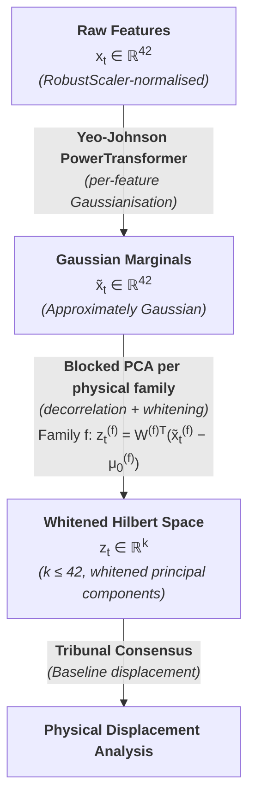

> [!IMPORTANT]
> **Technical Disclaimer:** The use of "Hilbert Space" in HiGI is a conceptual bridge between quantum state representation and high-dimensional network forensics.

### Conceptual Grounding

The nomenclature *Hilbert space* in HiGI is a deliberate conceptual reference to the mathematical framework of quantum mechanics, where the state of a system is represented as a vector in an infinite-dimensional inner product space. In quantum mechanics, measurement collapses the state vector onto an eigenstate; in HiGI, the Tribunal consensus collapses the multi-dimensional anomaly score onto a discrete severity level.

The analogy is not merely rhetorical. In both cases, the fundamental operation is the computation of a **distance from a reference state** (the baseline) using a metric that accounts for the natural variance of the system (the covariance structure). The Mahalanobis distance used by the BallTree detector is the classical mechanics analogue of the expectation value of the deviation operator in quantum theory.

### Implementation Reality

In concrete engineering terms, HiGI's "Hilbert space" is a finite-dimensional Euclidean space produced by the following sequence of transformations:

The resulting space `ℝ^k` has the property that:

1. **Euclidean distances approximate Mahalanobis distances** in the original feature space, because the Blocked PCA whitening effectively applies the inverse square root of the per-family covariance matrix.
2. **Each principal component maps to exactly one physical family**, because Blocked PCA operates independently per family. This is the property that makes forensic attribution possible: the PCA component that deviates most from the baseline can be directly traced back to its feature family.
3. **The space is maximally compact** for the given variance retention targets (`blocked_pca_variance_per_family`). Features with low discriminative power are collapsed into fewer components, reducing BallTree computation and improving statistical power.

The term "Hilbert space" in the codebase and documentation should therefore be understood as a conceptually motivated shorthand for: *a whitened, family-structured metric space in which the baseline distribution occupies a compact high-density region and anomalies are points geometrically distant from that region*.

### Why This Matters for Operational Trust

The physical grounding of the Hilbert projection is not an academic exercise. It is the engineering guarantee that a detection at 4,120σ (`payload_continuity_ratio`, DoS GoldenEye) is not a numerical artifact or a model pathology — it is the geometrically correct statement that the observed traffic window lies 4,120 baseline standard deviations away from the center of the normal traffic manifold, in the direction of maximum payload structure disruption. That statement is independently verifiable, dimensionally consistent, and operationally actionable.

Supervised models produce probabilities or class labels. HiGI produces **physical displacements from an inertial reference frame**. The difference is not cosmetic.