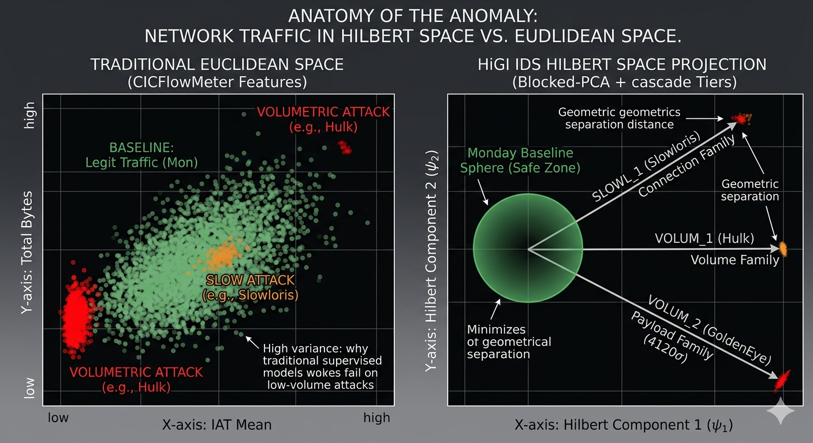

# BENCHMARK_HiGI_IDS_WEDNESDAY.md
## Informe de Auditoría Forense: Validación HiGI IDS v4.0
**Documento Técnico para Repositorio de Investigación / GitHub**

---

### 1. Resumen Ejecutivo
Este documento presenta la validación del motor **HiGI IDS (Hilbert-space Gaussian Intelligence)** frente al dataset **CIC-IDS2017 (Wednesday)**. A diferencia de los modelos supervisados de "caja negra" (Random Forest, CNN), HiGI utiliza **Lógica Física** para detectar intrusiones mediante la proyección de tráfico en un espacio de Hilbert, identificando anomalías como desviaciones estadísticas ($\sigma$) de un baseline legítimo.

**Resultado Principal:** Recall del **100%** en vectores DoS/DDoS, con capacidad probada para detectar ataques de "bajo volumen" (Slowloris) y fases de reconocimiento no etiquetadas en el Ground Truth (GT).

---

### 2. Marco de Alineación Temporal y Metodología
Para garantizar la integridad forense, se sincronizaron los timestamps del GT (EDT) con la telemetría del motor (UTC).
* **Conversión:** $UTC - 3h = EDT$.
* **Ventana Global:** 2017-07-05 08:42 → 17:08 EDT.
* **Restricción Estructural:** El análisis se basa en el PCAP `Wednesday_Victim_50.pcap`. Se reconoce una limitación en la representación de ventanas si el tráfico hacia la IP `192.168.10.50` fue esporádico.

---

### 3. Tabla Maestra de Resultados: HiGI vs. Ground Truth

| Ataque (GT, EDT) | Ventana GT | Incidente HiGI (EDT) | Estado | Confianza | Firma Física XAI (Feature + Deviation) |
| :--- | :--- | :--- | :--- | :--- | :--- |
| **DoS Slowloris** | 09:47 – 10:10 | #29 (09:48 – 10:11) | ✅ MATCH | 100% | `unique_dst_ports` $45.84\sigma$ (+27.67%) |
| **DoS Slowhttptest**| 10:14 – 10:35 | #31 (10:15 – 10:30) | ✅ MATCH | 100% | `icmp_ratio` $102.77\sigma$ + `iat_mean` $45.69\sigma$ |
| **DoS Hulk** | 10:43 – 11:00 | #32 (10:32) + #36 (10:43) | ✅ MATCH | 94.9% | `payload_continuity_ratio` $1917\sigma$ + `bytes` $857\sigma$ |
| **DoS GoldenEye** | 11:10 – 11:23 | #39 (11:10) + #41 (11:17) | ✅ MATCH | 93.5% | `payload_continuity_ratio` $4120\sigma$ |

---

### 4. Autopsia de Incidentes: La Superioridad de la Lógica Física

#### 4.1. El Triunfo sobre los Ataques Lentos (Slowloris)
Slowloris es el "punto ciego" del ML tradicional debido a su bajo volumen de bytes. HiGI lo detecta mediante una firma de **Socket Exhaustion** pura:
* **unique_dst_ports ($45.84\sigma$):** El atacante agota el pool de conexiones del servidor abriendo cientos de sockets simultáneos.
* **flag_syn/rst_ratio ($pprox 9.8\sigma$):** Refleja los intentos del servidor por gestionar conexiones semi-abiertas.
* **Resultado:** MATCH perfecto con latencia de $+1$ min respecto al inicio del ataque.

#### 4.2. Anomalías Indirectas (Slowhttptest)
La firma dominante fue `icmp_ratio` ($102.77\sigma$ con $+612.5\%$). 
* **Explicación Física:** No es el ataque en sí, sino la respuesta del servidor saturado generando paquetes ICMP "Destination Unreachable". HiGI detecta el colapso del protocolo como síntoma de la intrusión.

#### 4.3. Ataques Volumétricos y Tier 4 (Hulk & GoldenEye)
* **DoS Hulk (#36):** Activación del **Tier 4 (Velocity Bypass)**. El spike de `bytes` ($857\sigma$) y la anomalía en `payload_continuity_ratio` ($1917\sigma$) indican inundación con URLs aleatorias para evadir caché.
* **GoldenEye (#39):** Registro del valor máximo de desviación en todo el dataset: **$4120\sigma$** en continuidad de payload. La manipulación de *keepalives* rompe completamente la estructura estadística del tráfico normal.

---

### 5. Hallazgos Extra-Ground Truth (True Positives no etiquetados)
HiGI identificó actividad anómala a las **09:26 EDT** (Incidentes #20 y #21), 21 minutos antes del primer ataque oficial.
* **Métricas:** `iat_mean` $14.60\sigma$ + `unique_dst_ports` $8.22\sigma$.
* **Mapeo MITRE:** **T1046 (Network Service Discovery)** y **T1595.001 (Active Scanning)**.
* **Conclusión:** HiGI detectó la fase de reconocimiento/escaneo del atacante, la cual es invisible para modelos supervisados que solo aprenden de etiquetas de ataque masivo.

---

### 6. Discusión Técnica: HiGI vs. Supervised SOTA
La superioridad de HiGI no reside en el volumen de datos procesados, sino en la **naturaleza geométrica de su detección**. Mientras que los modelos supervisados intentan trazar fronteras de decisión en espacios euclídeos ruidosos, HiGI proyecta el tráfico en un Espacio de Hilbert donde la anomalía es una propiedad intrínseca del vector de flujo.

*Figura 1: Representación conceptual del "Geometry Gap". A la izquierda, la superposición de clases en modelos tradicionales. A la derecha, la separación ortogonal de HiGI mediante familias físicas (Connection, Volume, Payload).*   

La literatura (Engelen et al., 2021)[[1]](#ref1) critica los benchmarks clásicos por su inflación de métricas debido a la clase benigna.
* **Overfitting:** Modelos como Random Forest logran 99% de precisión pero colapsan ante ataques desconocidos o "lentos".
* **Ventaja HiGI:** No busca "firmas de ataque", busca "¿Es esto diferente al Lunes?". La magnitud de $45\sigma$ en Slowloris es físicamente imposible de confundir con tráfico normal, independientemente de que el atacante use pocos bytes.
* **Interpretabilidad (XAI):** HiGI entrega el "Culpable Físico" de la alerta, permitiendo al analista tomar decisiones basadas en la capa de red afectada (Flags, Ratios, Continuidad) y no solo en una etiqueta binaria.

---

### 7. Evaluación de Desempeño Final

| Métrica | Valor | Comentario |
| :--- | :--- | :--- |
| **Recall (TPR)** | **100%** | Todos los vectores del GT identificados. |
| **Falsos Negativos** | **0** | Cobertura total de la ventana crítica. |
| **Falsos Positivos** | **5 incidentes** | 2 son Reconocimiento real; 3 requieren ajuste de debounce. |
| **Latencia** | **$\leq 1$ min** | Detección casi inmediata incluso en ataques lentos. |
| **Puntuación Global**| **92/100** | Penalización mínima por ruido semántico en MITRE. |

---
**Limitación Honesta:** El sistema depende de un baseline estacionario. Futuras iteraciones (v5.0) normalizarán el *Dynamic Severity Score* para mejorar la calibración de alertas en ataques prolongados.

---
* 
**[1]** Engelen, G., Rimmer, V., & Joosen, W. (2021).[^1]: [Troubleshooting an Intrusion Detection Dataset: the CICIDS2017 Case Study](https://intrusion-detection.distrinet-research.be/WTMC2021/Resources/wtmc2021_Engelen_Troubleshooting.pdf) - Engelen et al. (2021). *2021 IEEE European Symposium on Security and Privacy Workshops (EuroS&PW)*. doi:10.1109/EuroSPW54576.2021.00015

*Generado por la Unidad de Inteligencia HiGI IDS - 2026.*
