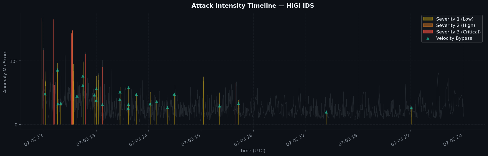
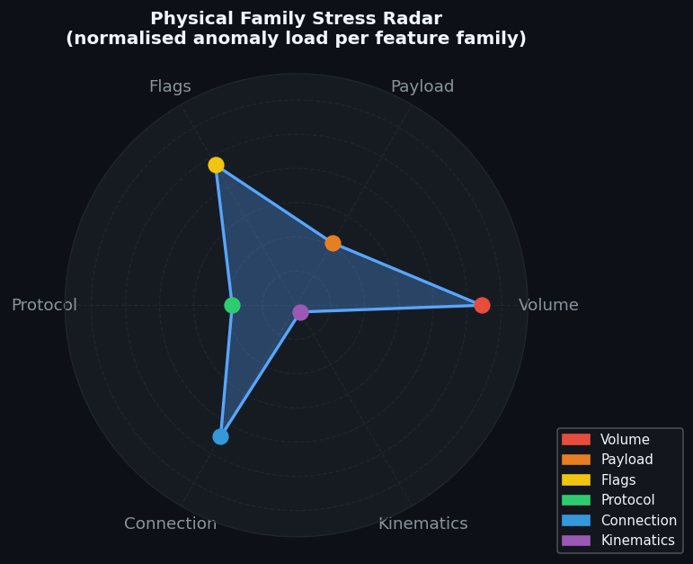

# HiGI IDS — Forensic Security Incident Report

> **Generated:** 2026-04-29 06:37:53 UTC  
> **Source file:** `Monday_Victim_50_results.csv`  
> **Analysis window:** 2017-07-03 11:57:48 → 2017-07-03 20:01:08

## Analysis Parameters

| Parameter | Value | Purpose |
|-----------|-------|---------|
| Incident debounce | 30 s | Maximum gap for grouping consecutive anomalies |
| Data-drop threshold | 60 s | Gap size flagged as sensor blindness |
| Confidence filter | 80% | Minimum tier-weighted confidence for reporting |
| Min anomalies/incident | 1 | Alert-fatigue suppression floor |
| Min duration | 1.0 s | Minimum incident duration |
| Min σ culprit | 2.0 | Minimum mean \|σ\| to include in report |

## Executive Summary

- **Total anomalous windows detected:** 266
- **Reportable incidents after filtering:** 0
- **Maximum severity:** 3/3 (Critical — Full unanimity)
- **Average severity:** 0.68/3
- **Average incident duration:** 0.0 s
- **Telemetry data-drops detected:** 22

## Physical Family Stress Distribution

| Family | Anomaly Count | Share | Interpretation |
|--------|--------------|-------|----------------|
| **Volume** | 72 | 27.1% | Bandwidth/PPS overload — volumetric DoS or data exfiltration |
| **Flags** | 63 | 23.7% | TCP-flag manipulation — possible SYN/RST/FIN flood or stealth scan |
| **Connection** | 59 | 22.2% | Connection-topology anomaly — port-scan, service discovery |
| **Payload** | 28 | 10.5% | Payload anomaly — obfuscation, encryption or protocol tunnelling |
| **Protocol** | 25 | 9.4% | Protocol-ratio shift — possible protocol abuse or evasion |
| **Volume_flood** | 9 | 3.4% | – |
| **Unknown** | 5 | 1.9% | Family could not be inferred from available metadata |
| **Kinematics** | 3 | 1.1% | Rate/volatility anomaly — beaconing, slow-rate attack or burst |
| **Slow_attack** | 2 | 0.8% | – |

## Visual Evidence

### Figure 1 — Attack Intensity Timeline

**Reading guide:** Coloured fill indicates severity level (yellow = Severity 1, orange = Severity 2, red = Severity 3). Teal downward triangles mark Velocity Bypass events. Callout boxes annotate the three highest-severity incidents with their primary culprit metric.

### Figure 2 — Physical Family Stress Radar

**Reading guide:** Each axis represents a physical feature family. A larger filled area indicates that family contributed more anomaly load. Dominant axes identify the primary attack vector and guide immediate countermeasure prioritisation.

## Detailed Incident Analysis

> No incidents met the reporting thresholds after filtering.

## Telemetry Data Drops

| Start (UTC) | End (UTC) | Gap (s) | Severity Before | Reason |
|------------|----------|---------|----------------|--------|
| 12:21:36 | 12:22:39 | 63.0 | – | Capture Loss / Network Silence |
| 12:31:51 | 12:32:52 | 60.7 | 3 | Sensor Blindness / Data Drop due to Saturation |
| 15:38:44 | 15:39:50 | 66.0 | – | Capture Loss / Network Silence |
| 15:46:06 | 15:47:45 | 99.0 | – | Capture Loss / Network Silence |
| 16:02:05 | 16:03:20 | 75.6 | – | Capture Loss / Network Silence |
| 16:03:23 | 16:04:51 | 87.6 | – | Capture Loss / Network Silence |
| 16:23:40 | 16:24:40 | 60.1 | – | Capture Loss / Network Silence |
| 16:36:52 | 16:38:12 | 80.6 | – | Capture Loss / Network Silence |
| 16:40:03 | 16:41:06 | 63.5 | – | Capture Loss / Network Silence |
| 16:49:53 | 16:51:01 | 68.2 | – | Capture Loss / Network Silence |
| 17:06:59 | 17:08:23 | 83.8 | – | Capture Loss / Network Silence |
| 17:41:55 | 17:43:04 | 69.1 | – | Capture Loss / Network Silence |
| 18:08:22 | 18:09:45 | 83.4 | – | Capture Loss / Network Silence |
| 18:36:07 | 18:37:26 | 78.9 | – | Capture Loss / Network Silence |
| 19:02:37 | 19:04:31 | 113.8 | – | Capture Loss / Network Silence |
| 19:36:07 | 19:39:30 | 202.2 | – | Capture Loss / Network Silence |
| 19:41:07 | 19:42:26 | 78.1 | – | Capture Loss / Network Silence |
| 19:43:20 | 19:44:52 | 91.9 | – | Capture Loss / Network Silence |
| 19:51:08 | 19:52:20 | 72.7 | – | Capture Loss / Network Silence |
| 19:52:23 | 19:54:15 | 112.1 | – | Capture Loss / Network Silence |
| 19:56:08 | 19:58:05 | 117.2 | – | Capture Loss / Network Silence |
| 19:58:32 | 19:59:37 | 65.1 | – | Capture Loss / Network Silence |

---

*Report generated automatically by **HiGI IDS ForensicEngine V2.0**.*  
*Consult your security team for remediation guidance.*
