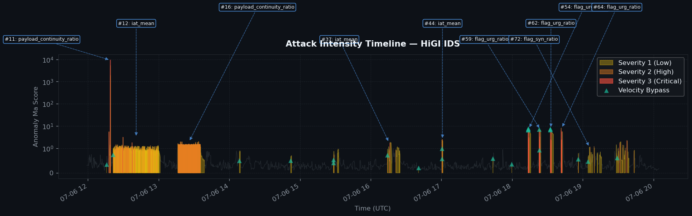
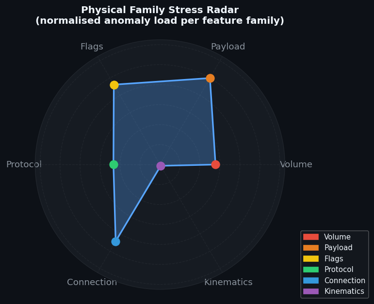

# HiGI IDS — Forensic Security Incident Report

> **Generated:** 2026-04-27 09:08:31 UTC  
> **Source file:** `Thursday_Victim_50_results.csv`  
> **Analysis window:** 2017-07-06 11:59:00 → 2017-07-06 20:04:36

## Analysis Parameters

| Parameter | Value | Purpose |
|-----------|-------|---------|
| Incident debounce | 30 s | Maximum gap for grouping consecutive anomalies |
| Data-drop threshold | 60 s | Gap size flagged as sensor blindness |
| Confidence filter | 80% | Minimum tier-weighted confidence for reporting |
| Min anomalies/incident | 3 | Alert-fatigue suppression floor |
| Min duration | 1.0 s | Minimum incident duration |
| Min σ culprit | 2.0 | Minimum mean \|σ\| to include in report |

## Executive Summary

- **Total anomalous windows detected:** 3,954
- **Reportable incidents after filtering:** 10
- **Maximum severity:** 3/3 (Critical — Full unanimity)
- **Average severity:** 1.16/3
- **Average incident duration:** 437.3 s
- **Telemetry data-drops detected:** 43

## Physical Family Stress Distribution

| Family | Anomaly Count | Share | Interpretation |
|--------|--------------|-------|----------------|
| **Volume** | 1,525 | 38.6% | Bandwidth/PPS overload — volumetric DoS or data exfiltration |
| **Payload** | 1,203 | 30.4% | Payload anomaly — obfuscation, encryption or protocol tunnelling |
| **Connection** | 614 | 15.5% | Connection-topology anomaly — port-scan, service discovery |
| **Flags** | 365 | 9.2% | TCP-flag manipulation — possible SYN/RST/FIN flood or stealth scan |
| **Slow_attack** | 121 | 3.1% | – |
| **Kinematics** | 59 | 1.5% | Rate/volatility anomaly — beaconing, slow-rate attack or burst |
| **Volume_flood** | 41 | 1.0% | – |
| **Protocol** | 21 | 0.5% | Protocol-ratio shift — possible protocol abuse or evasion |
| **Recon** | 5 | 0.1% | – |

## Visual Evidence

### Figure 1 — Attack Intensity Timeline

**Reading guide:** Coloured fill indicates severity level (yellow = Severity 1, orange = Severity 2, red = Severity 3). Teal downward triangles mark Velocity Bypass events. Callout boxes annotate the three highest-severity incidents with their primary culprit metric.

### Figure 2 — Physical Family Stress Radar

**Reading guide:** Each axis represents a physical feature family. A larger filled area indicates that family contributed more anomaly load. Dominant axes identify the primary attack vector and guide immediate countermeasure prioritisation.

## Detailed Incident Analysis

### Incident #11

| Field | Value |
|-------|-------|
| **Start (UTC)** | 2017-07-06 12:17:15 |
| **End (UTC)** | 2017-07-06 12:20:07 |
| **Duration** | 172 s |
| **Anomalous windows** | 42 |
| **Max severity** | 3/3 — Critical — Full unanimity |
| **Dynamic severity score** | 32063880.58 |
| **Consensus confidence** | 83.1% |
| **Persistence label** | Sustained Attack |
| **Top-3 destination ports** | 80, 33964, 22 |
| **Warm-up period** | No |

#### Tier Evidence

| Tier | Fired | Fire Count | Mean Score |
|------|-------|-----------|------------|
| BallTree | ✅ | 32 | 1977.2404 |
| GMM | ✅ | 18 | 0.7619 |
| IForest | ✅ | 16 | 0.3656 |
| PhysicalSentinel | ✅ | 42 | 7217.1347 |
| VelocityBypass | — | 0 | 0.1831 |

#### Top-3 Physical Feature Attributions (XAI)

| Rank | Feature | Family | Event Type | Max \|σ\| | Max Δ% | Loading |
|------|---------|--------|-----------|--------|--------|---------|
| 1 | `payload_continuity_ratio` | Payload | ⬆ SPIKE | 38836.05σ | 229363186% | 1.000 |
| 2 | `bytes` | Volume | ⬆ SPIKE | 93.65σ | 21557% | 0.002 |
| 3 | `flag_rst_ratio` | Flags | ⬆ SPIKE | 7.80σ | 7245% | 0.000 |

#### MITRE ATT&CK Mapping

- **Impact**
  - T1498.001 – UDP Flood / Amplification
  - T1499.002 – DoS: Endpoint Service (RST Flood)
  - T1498 – Resource Exhaustion: Bandwidth Volatility
  - T1190 – Exploit Public-Facing Application (Slow DoS)
  - T1498 – Volumetric PPS Volatility
- **Exfiltration**
  - T1048 – Oversized Packet Exfiltration
- **Command & Control**
  - T1573 – Encrypted / Obfuscated Traffic
- **Reconnaissance**
  - T1595 – Active Scanning (Stealth FIN Scan)

### Incident #12

| Field | Value |
|-------|-------|
| **Start (UTC)** | 2017-07-06 12:21:15 |
| **End (UTC)** | 2017-07-06 13:00:35 |
| **Duration** | 2360 s |
| **Anomalous windows** | 2315 |
| **Max severity** | 3/3 — Critical — Full unanimity |
| **Dynamic severity score** | 215.99 |
| **Consensus confidence** | 100.0% |
| **Persistence label** | Sustained Attack |
| **Top-3 destination ports** | 80, 123, 40048 |
| **Warm-up period** | No |

#### Tier Evidence

| Tier | Fired | Fire Count | Mean Score |
|------|-------|-----------|------------|
| BallTree | ✅ | 2228 | 0.9397 |
| GMM | ✅ | 182 | 0.9624 |
| IForest | ✅ | 186 | 0.2243 |
| PhysicalSentinel | ✅ | 2315 | 3.3488 |
| VelocityBypass | ✅ | 1 | 0.2177 |

#### Top-3 Physical Feature Attributions (XAI)

| Rank | Feature | Family | Event Type | Max \|σ\| | Max Δ% | Loading |
|------|---------|--------|-----------|--------|--------|---------|
| 1 | `iat_mean` | Connection | ⬆ SPIKE | 52.43σ | 18315% | 1.000 |
| 2 | `unique_dst_ports` | Volume_flood | ⬆ SPIKE | 10.12σ | 6108% | 0.193 |
| 3 | `size_max` | Payload | ⬆ SPIKE | 7.15σ | 1856% | 0.136 |

#### MITRE ATT&CK Mapping

- **Command & Control**
  - T1573 – Encrypted / Obfuscated Traffic
  - T1071 – Beaconing / Irregular IAT
- **Exfiltration**
  - T1048 – Oversized Packet Exfiltration
- **Reconnaissance**
  - T1595 – Active Scanning (Stealth FIN Scan)
  - T1046 – Network Service Discovery
- **Impact**
  - T1498 – Resource Exhaustion: Bandwidth Volatility
  - T1498 – Volumetric PPS Volatility
  - T1190 – Exploit Public-Facing Application (Slow DoS)
  - T1498.001 – DoS: Direct Network Flood (SYN Flood)
  - T1499.002 – DoS: Endpoint Service (RST Flood)
  - T1498.001 – UDP Flood / Amplification

### Incident #16

| Field | Value |
|-------|-------|
| **Start (UTC)** | 2017-07-06 13:15:36 |
| **End (UTC)** | 2017-07-06 13:36:05 |
| **Duration** | 1229 s |
| **Anomalous windows** | 1138 |
| **Max severity** | 2/3 — High — Majority consensus |
| **Dynamic severity score** | 9.13 |
| **Consensus confidence** | 97.0% |
| **Persistence label** | Sustained Attack |
| **Top-3 destination ports** | 80, 123, 137 |
| **Warm-up period** | No |

#### Tier Evidence

| Tier | Fired | Fire Count | Mean Score |
|------|-------|-----------|------------|
| BallTree | ✅ | 1124 | 1.3578 |
| GMM | ✅ | 561 | 0.9877 |
| IForest | ✅ | 462 | 0.3312 |
| PhysicalSentinel | ✅ | 1138 | 4.7665 |
| VelocityBypass | — | 0 | 0.2149 |

#### Top-3 Physical Feature Attributions (XAI)

| Rank | Feature | Family | Event Type | Max \|σ\| | Max Δ% | Loading |
|------|---------|--------|-----------|--------|--------|---------|
| 1 | `payload_continuity_ratio` | Payload | ⬆ SPIKE | 11.87σ | 70100% | 1.000 |
| 2 | `payload_continuity` | Payload | ⬆ SPIKE | 9.27σ | 12620% | 0.781 |
| 3 | `iat_mean` | Connection | ⬆ SPIKE | 6.91σ | 2342% | 0.582 |

#### MITRE ATT&CK Mapping

- **Reconnaissance**
  - T1595.001 – Active Scanning: IP Addresses
  - T1595 – Active Scanning (Stealth FIN Scan)
- **Impact**
  - T1498 – Resource Exhaustion: Bandwidth Volatility
  - T1498.001 – DoS: Direct Network Flood (SYN Flood)
  - T1190 – Exploit Public-Facing Application (Slow DoS)
- **Command & Control**
  - T1573 – Encrypted / Obfuscated Traffic
  - T1071 – Beaconing / Irregular IAT

### Incident #37

| Field | Value |
|-------|-------|
| **Start (UTC)** | 2017-07-06 16:14:12 |
| **End (UTC)** | 2017-07-06 16:16:43 |
| **Duration** | 151 s |
| **Anomalous windows** | 25 |
| **Max severity** | 3/3 — Critical — Full unanimity |
| **Dynamic severity score** | 51.06 |
| **Consensus confidence** | 83.3% |
| **Persistence label** | Sustained Attack |
| **Top-3 destination ports** | 80, 22, 138 |
| **Warm-up period** | No |

#### Tier Evidence

| Tier | Fired | Fire Count | Mean Score |
|------|-------|-----------|------------|
| BallTree | ✅ | 13 | 0.9724 |
| GMM | ✅ | 7 | 0.5200 |
| IForest | ✅ | 6 | 0.1838 |
| PhysicalSentinel | ✅ | 25 | 5.0285 |
| VelocityBypass | ✅ | 1 | 0.2485 |

#### Top-3 Physical Feature Attributions (XAI)

| Rank | Feature | Family | Event Type | Max \|σ\| | Max Δ% | Loading |
|------|---------|--------|-----------|--------|--------|---------|
| 1 | `iat_mean` | Connection | ⬆ SPIKE | 32.38σ | 11311% | 1.000 |
| 2 | `payload_continuity` | Payload | ⬆ SPIKE | 9.25σ | 13551% | 0.286 |
| 3 | `flag_syn_ratio` | Flags | ⬆ SPIKE | 9.13σ | 1745% | 0.282 |

#### MITRE ATT&CK Mapping

- **Impact**
  - T1498.001 – DoS: Direct Network Flood (SYN Flood)
  - T1499.002 – DoS: Endpoint Service (RST Flood)
  - T1190 – Exploit Public-Facing Application (Slow DoS)
  - T1498.001 – UDP Flood / Amplification
- **Reconnaissance**
  - T1595.001 – Active Scanning: IP Addresses
  - T1595 – Active Scanning (Stealth FIN Scan)
- **Command & Control**
  - T1573 – Encrypted / Obfuscated Traffic
  - T1071 – Beaconing / Irregular IAT
- **Exfiltration**
  - T1048 – Oversized Packet Exfiltration

### Incident #44

| Field | Value |
|-------|-------|
| **Start (UTC)** | 2017-07-06 17:00:31 |
| **End (UTC)** | 2017-07-06 17:01:17 |
| **Duration** | 46 s |
| **Anomalous windows** | 24 |
| **Max severity** | 2/3 — High — Majority consensus |
| **Dynamic severity score** | 7.27 |
| **Consensus confidence** | 83.1% |
| **Persistence label** | Sustained Attack |
| **Top-3 destination ports** | 443, 22, 444 |
| **Warm-up period** | No |

#### Tier Evidence

| Tier | Fired | Fire Count | Mean Score |
|------|-------|-----------|------------|
| BallTree | ✅ | 15 | 1.6240 |
| GMM | ✅ | 13 | 0.6250 |
| IForest | ✅ | 13 | 0.3948 |
| PhysicalSentinel | ✅ | 24 | 6.9693 |
| VelocityBypass | ✅ | 2 | 0.4155 |

#### Top-3 Physical Feature Attributions (XAI)

| Rank | Feature | Family | Event Type | Max \|σ\| | Max Δ% | Loading |
|------|---------|--------|-----------|--------|--------|---------|
| 1 | `iat_mean` | Connection | ⬆ SPIKE | 12.29σ | 4292% | 1.000 |
| 2 | `flag_rst_ratio` | Flags | ⬆ SPIKE | 10.24σ | 9081% | 0.833 |
| 3 | `flag_syn_ratio` | Flags | ⬆ SPIKE | 9.13σ | 1745% | 0.743 |

#### MITRE ATT&CK Mapping

- **Impact**
  - T1498.001 – DoS: Direct Network Flood (SYN Flood)
  - T1499.002 – DoS: Endpoint Service (RST Flood)
- **Command & Control**
  - T1071 – Beaconing / Irregular IAT
- **Exfiltration**
  - T1048 – Oversized Packet Exfiltration
- **Reconnaissance**
  - T1595 – Active Scanning (Stealth FIN Scan)

### Incident #54

| Field | Value |
|-------|-------|
| **Start (UTC)** | 2017-07-06 18:13:41 |
| **End (UTC)** | 2017-07-06 18:14:55 |
| **Duration** | 74 s |
| **Anomalous windows** | 24 |
| **Max severity** | 3/3 — Critical — Full unanimity |
| **Dynamic severity score** | 777.29 |
| **Consensus confidence** | 83.1% |
| **Persistence label** | Sustained Attack |
| **Top-3 destination ports** | 45585, 445, 21 |
| **Warm-up period** | No |

#### Tier Evidence

| Tier | Fired | Fire Count | Mean Score |
|------|-------|-----------|------------|
| BallTree | ✅ | 20 | 3.7076 |
| GMM | ✅ | 15 | 0.8333 |
| IForest | ✅ | 14 | 0.4229 |
| PhysicalSentinel | ✅ | 24 | 14.2333 |
| VelocityBypass | ✅ | 4 | 0.4458 |

#### Top-3 Physical Feature Attributions (XAI)

| Rank | Feature | Family | Event Type | Max \|σ\| | Max Δ% | Loading |
|------|---------|--------|-----------|--------|--------|---------|
| 1 | `flag_urg_ratio` | Flags | ⬆ SPIKE | 34996.50σ | 35000000000% | 1.000 |
| 2 | `unique_dst_ports` | Connection | ⬆ SPIKE | 134.88σ | 81418% | 0.004 |
| 3 | `icmp_ratio` | Protocol | ⬆ SPIKE | 77.07σ | 459372% | 0.002 |

#### MITRE ATT&CK Mapping

- **Reconnaissance**
  - T1046 – Network Service Discovery
  - T1595 – Active Scanning (Stealth FIN Scan)
- **Impact**
  - T1498.001 – DoS: Direct Network Flood (SYN Flood)
  - T1190 – Exploit Public-Facing Application (Slow DoS)
  - T1499.002 – DoS: Endpoint Service (RST Flood)
- **Command & Control**
  - T1573 – Encrypted / Obfuscated Traffic
- **Exfiltration**
  - T1048 – Oversized Packet Exfiltration

### Incident #59

| Field | Value |
|-------|-------|
| **Start (UTC)** | 2017-07-06 18:23:01 |
| **End (UTC)** | 2017-07-06 18:24:20 |
| **Duration** | 80 s |
| **Anomalous windows** | 33 |
| **Max severity** | 3/3 — Critical — Full unanimity |
| **Dynamic severity score** | 814.44 |
| **Consensus confidence** | 84.8% |
| **Persistence label** | Sustained Attack |
| **Top-3 destination ports** | 22, 51700, 445 |
| **Warm-up period** | No |

#### Tier Evidence

| Tier | Fired | Fire Count | Mean Score |
|------|-------|-----------|------------|
| BallTree | ✅ | 25 | 2.9755 |
| GMM | ✅ | 15 | 0.7576 |
| IForest | ✅ | 14 | 0.3453 |
| PhysicalSentinel | ✅ | 33 | 11.6695 |
| VelocityBypass | ✅ | 2 | 0.3155 |

#### Top-3 Physical Feature Attributions (XAI)

| Rank | Feature | Family | Event Type | Max \|σ\| | Max Δ% | Loading |
|------|---------|--------|-----------|--------|--------|---------|
| 1 | `flag_urg_ratio` | Flags | ⬆ SPIKE | 37732.08σ | 37735849057% | 1.000 |
| 2 | `unique_dst_ports` | Connection | ⬆ SPIKE | 135.56σ | 81826% | 0.004 |
| 3 | `icmp_ratio` | Protocol | ⬆ SPIKE | 77.07σ | 459372% | 0.002 |

#### MITRE ATT&CK Mapping

- **Reconnaissance**
  - T1046 – Network Service Discovery
  - T1595 – Active Scanning (Stealth FIN Scan)
- **Impact**
  - T1498.001 – DoS: Direct Network Flood (SYN Flood)
  - T1498 – Volumetric PPS Volatility
  - T1190 – Exploit Public-Facing Application (Slow DoS)
  - T1499.002 – DoS: Endpoint Service (RST Flood)
- **Command & Control**
  - T1573 – Encrypted / Obfuscated Traffic
  - T1071 – Beaconing / Irregular IAT

### Incident #62

| Field | Value |
|-------|-------|
| **Start (UTC)** | 2017-07-06 18:32:27 |
| **End (UTC)** | 2017-07-06 18:33:28 |
| **Duration** | 61 s |
| **Anomalous windows** | 25 |
| **Max severity** | 3/3 — Critical — Full unanimity |
| **Dynamic severity score** | 787.71 |
| **Consensus confidence** | 83.3% |
| **Persistence label** | Sustained Attack |
| **Top-3 destination ports** | 445, 53719, 65389 |
| **Warm-up period** | No |

#### Tier Evidence

| Tier | Fired | Fire Count | Mean Score |
|------|-------|-----------|------------|
| BallTree | ✅ | 22 | 3.5814 |
| GMM | ✅ | 13 | 0.8800 |
| IForest | ✅ | 14 | 0.3963 |
| PhysicalSentinel | ✅ | 25 | 13.4053 |
| VelocityBypass | ✅ | 3 | 0.3661 |

#### Top-3 Physical Feature Attributions (XAI)

| Rank | Feature | Family | Event Type | Max \|σ\| | Max Δ% | Loading |
|------|---------|--------|-----------|--------|--------|---------|
| 1 | `flag_urg_ratio` | Flags | ⬆ SPIKE | 66660.00σ | 66666666667% | 1.000 |
| 2 | `unique_dst_ports` | Connection | ⬆ SPIKE | 135.56σ | 81826% | 0.002 |
| 3 | `icmp_ratio` | Protocol | ⬆ SPIKE | 77.07σ | 459372% | 0.001 |

#### MITRE ATT&CK Mapping

- **Reconnaissance**
  - T1046 – Network Service Discovery
- **Impact**
  - T1498.001 – DoS: Direct Network Flood (SYN Flood)
  - T1499.002 – DoS: Endpoint Service (RST Flood)
  - T1190 – Exploit Public-Facing Application (Slow DoS)
  - T1498 – Resource Exhaustion: Bandwidth Volatility
- **Command & Control**
  - T1573 – Encrypted / Obfuscated Traffic
- **Exfiltration**
  - T1048 – Oversized Packet Exfiltration

### Incident #64

| Field | Value |
|-------|-------|
| **Start (UTC)** | 2017-07-06 18:41:35 |
| **End (UTC)** | 2017-07-06 18:42:44 |
| **Duration** | 68 s |
| **Anomalous windows** | 25 |
| **Max severity** | 3/3 — Critical — Full unanimity |
| **Dynamic severity score** | 787.80 |
| **Consensus confidence** | 80.3% |
| **Persistence label** | Sustained Attack |
| **Top-3 destination ports** | 22, 59830, 445 |
| **Warm-up period** | No |

#### Tier Evidence

| Tier | Fired | Fire Count | Mean Score |
|------|-------|-----------|------------|
| BallTree | ✅ | 20 | 3.4978 |
| GMM | ✅ | 14 | 0.8000 |
| IForest | ✅ | 15 | 0.3863 |
| PhysicalSentinel | ✅ | 25 | 13.1612 |
| VelocityBypass | — | 0 | 0.2947 |

#### Top-3 Physical Feature Attributions (XAI)

| Rank | Feature | Family | Event Type | Max \|σ\| | Max Δ% | Loading |
|------|---------|--------|-----------|--------|--------|---------|
| 1 | `flag_urg_ratio` | Flags | ⬆ SPIKE | 216194.60σ | 216216216216% | 1.000 |
| 2 | `unique_dst_ports` | Connection | ⬆ SPIKE | 135.56σ | 81826% | 0.001 |
| 3 | `icmp_ratio` | Protocol | ⬆ SPIKE | 77.07σ | 459372% | 0.000 |

#### MITRE ATT&CK Mapping

- **Reconnaissance**
  - T1046 – Network Service Discovery
- **Impact**
  - T1498.001 – DoS: Direct Network Flood (SYN Flood)
  - T1190 – Exploit Public-Facing Application (Slow DoS)
  - T1498 – Resource Exhaustion: Bandwidth Volatility
  - T1499.002 – DoS: Endpoint Service (RST Flood)
  - T1498.001 – UDP Flood / Amplification
- **Command & Control**
  - T1573 – Encrypted / Obfuscated Traffic

### Incident #72

| Field | Value |
|-------|-------|
| **Start (UTC)** | 2017-07-06 19:04:27 |
| **End (UTC)** | 2017-07-06 19:06:40 |
| **Duration** | 133 s |
| **Anomalous windows** | 17 |
| **Max severity** | 2/3 — High — Majority consensus |
| **Dynamic severity score** | 2.44 |
| **Consensus confidence** | 81.2% |
| **Persistence label** | Sustained Attack |
| **Top-3 destination ports** | 22, 80, 53900 |
| **Warm-up period** | No |

#### Tier Evidence

| Tier | Fired | Fire Count | Mean Score |
|------|-------|-----------|------------|
| BallTree | ✅ | 7 | 0.6401 |
| GMM | ✅ | 4 | 0.4118 |
| IForest | ✅ | 4 | 0.1443 |
| PhysicalSentinel | ✅ | 17 | 3.5055 |
| VelocityBypass | ✅ | 1 | 0.2703 |

#### Top-3 Physical Feature Attributions (XAI)

| Rank | Feature | Family | Event Type | Max \|σ\| | Max Δ% | Loading |
|------|---------|--------|-----------|--------|--------|---------|
| 1 | `flag_syn_ratio` | Flags | ⬆ SPIKE | 9.13σ | 1745% | 1.000 |
| 2 | `port_scan_ratio` | Volume_flood | ⬆ SPIKE | 4.77σ | 402% | 0.522 |
| 3 | `size_max` | Payload | ⬆ SPIKE | 4.52σ | 613% | 0.496 |

#### MITRE ATT&CK Mapping

- **Impact**
  - T1498.001 – DoS: Direct Network Flood (SYN Flood)
- **Reconnaissance**
  - T1595.001 – Active Scanning: IP Addresses
  - T1595 – Active Scanning (Stealth FIN Scan)
- **Command & Control**
  - T1573 – Encrypted / Obfuscated Traffic
- **Exfiltration**
  - T1048 – Oversized Packet Exfiltration

## Telemetry Data Drops

| Start (UTC) | End (UTC) | Gap (s) | Severity Before | Reason |
|------------|----------|---------|----------------|--------|
| 13:43:09 | 13:44:13 | 63.7 | – | Capture Loss / Network Silence |
| 13:47:26 | 13:48:27 | 61.4 | – | Capture Loss / Network Silence |
| 14:01:09 | 14:02:30 | 81.4 | – | Capture Loss / Network Silence |
| 14:09:45 | 14:11:11 | 85.9 | – | Capture Loss / Network Silence |
| 14:18:48 | 14:20:11 | 82.9 | – | Capture Loss / Network Silence |
| 14:22:41 | 14:24:31 | 109.7 | – | Capture Loss / Network Silence |
| 14:30:05 | 14:31:15 | 70.3 | – | Capture Loss / Network Silence |
| 15:07:10 | 15:08:21 | 71.4 | – | Capture Loss / Network Silence |
| 15:11:26 | 15:12:58 | 92.2 | – | Capture Loss / Network Silence |
| 15:19:12 | 15:20:18 | 65.5 | – | Capture Loss / Network Silence |
| 15:22:04 | 15:23:08 | 63.5 | – | Capture Loss / Network Silence |
| 15:44:43 | 15:45:50 | 67.2 | – | Capture Loss / Network Silence |
| 16:04:38 | 16:06:40 | 122.1 | – | Capture Loss / Network Silence |
| 16:12:21 | 16:13:32 | 71.4 | – | Capture Loss / Network Silence |
| 16:24:53 | 16:26:45 | 112.0 | – | Capture Loss / Network Silence |
| 16:39:26 | 16:40:37 | 70.5 | – | Capture Loss / Network Silence |
| 16:45:49 | 16:46:50 | 61.2 | – | Capture Loss / Network Silence |
| 16:49:56 | 16:50:58 | 62.4 | – | Capture Loss / Network Silence |
| 17:03:46 | 17:05:20 | 94.5 | – | Capture Loss / Network Silence |
| 17:13:18 | 17:14:47 | 89.1 | – | Capture Loss / Network Silence |
| 17:39:51 | 17:40:52 | 60.8 | – | Capture Loss / Network Silence |
| 17:42:03 | 17:43:29 | 86.2 | – | Capture Loss / Network Silence |
| 17:53:03 | 17:54:19 | 76.9 | – | Capture Loss / Network Silence |
| 17:59:59 | 18:01:25 | 85.6 | – | Capture Loss / Network Silence |
| 18:15:53 | 18:16:58 | 65.6 | – | Capture Loss / Network Silence |
| 18:18:50 | 18:19:52 | 61.5 | – | Capture Loss / Network Silence |
| 18:19:52 | 18:21:07 | 75.2 | – | Capture Loss / Network Silence |
| 18:25:26 | 18:27:14 | 108.9 | – | Capture Loss / Network Silence |
| 18:33:28 | 18:35:03 | 94.5 | 1 | Capture Loss / Network Silence |
| 18:35:57 | 18:37:17 | 79.8 | – | Capture Loss / Network Silence |
| 18:42:45 | 18:44:10 | 85.4 | – | Capture Loss / Network Silence |
| 18:53:11 | 18:54:19 | 68.7 | – | Capture Loss / Network Silence |
| 19:00:11 | 19:01:59 | 107.8 | – | Capture Loss / Network Silence |
| 19:17:27 | 19:18:43 | 75.9 | – | Capture Loss / Network Silence |
| 19:18:46 | 19:20:01 | 75.0 | – | Capture Loss / Network Silence |
| 19:36:17 | 19:37:29 | 71.9 | 2 | Sensor Blindness / Data Drop due to Saturation |
| 19:40:42 | 19:42:29 | 107.7 | – | Capture Loss / Network Silence |
| 19:44:36 | 19:45:51 | 75.7 | – | Capture Loss / Network Silence |
| 19:50:03 | 19:51:35 | 92.3 | – | Capture Loss / Network Silence |
| 19:54:20 | 19:55:27 | 67.1 | – | Capture Loss / Network Silence |
| 19:56:00 | 19:57:27 | 87.7 | – | Capture Loss / Network Silence |
| 19:58:09 | 19:59:24 | 75.7 | – | Capture Loss / Network Silence |
| 20:02:38 | 20:04:36 | 118.5 | – | Capture Loss / Network Silence |

---

*Report generated automatically by **HiGI IDS ForensicEngine V2.0**.*  
*Consult your security team for remediation guidance.*
