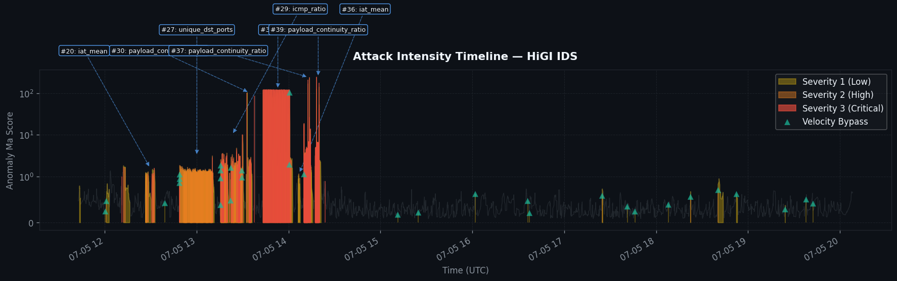
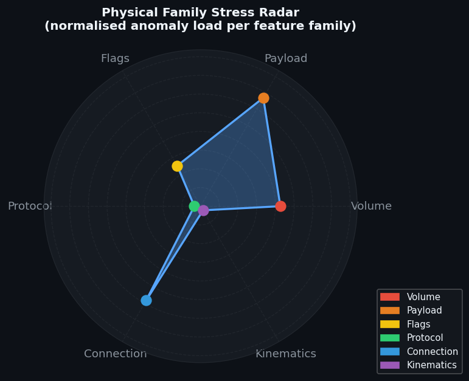

# HiGI IDS — Forensic Security Incident Report

> **Generated:** 2026-05-07 08:16:54 UTC  
> **Source file:** `Wednesday_Victim_50_results.csv`  
> **Analysis window:** 2017-07-05 11:42:42 → 2017-07-05 20:08:17

## Analysis Parameters

| Parameter | Value | Purpose |
|-----------|-------|---------|
| Incident debounce | 30 s | Maximum gap for grouping consecutive anomalies |
| Data-drop threshold | 60 s | Gap size flagged as sensor blindness |
| Confidence filter | 80% | Minimum tier-weighted confidence for reporting |
| Min anomalies/incident | 1 | Alert-fatigue suppression floor |
| Min duration | 1.0 s | Minimum incident duration |
| Min σ culprit | 2.0 | Minimum mean \|σ\| to include in report |

## Executive Summary

- **Total anomalous windows detected:** 3,597
- **Reportable incidents after filtering:** 8
- **Maximum severity:** 3/3 (Critical — Full unanimity)
- **Average severity:** 1.82/3
- **Average incident duration:** 597.7 s
- **Telemetry data-drops detected:** 19

## Physical Family Stress Distribution

| Family | Anomaly Count | Share | Interpretation |
|--------|--------------|-------|----------------|
| **Flags** | 1,246 | 34.6% | TCP-flag manipulation — possible SYN/RST/FIN flood or stealth scan |
| **Connection** | 1,047 | 29.1% | Connection-topology anomaly — port-scan, service discovery |
| **Volume** | 774 | 21.5% | Bandwidth/PPS overload — volumetric DoS or data exfiltration |
| **Payload** | 319 | 8.9% | Payload anomaly — obfuscation, encryption or protocol tunnelling |
| **Kinematics** | 125 | 3.5% | Rate/volatility anomaly — beaconing, slow-rate attack or burst |
| **Volume_flood** | 48 | 1.3% | – |
| **Slow_attack** | 22 | 0.6% | – |
| **Protocol** | 16 | 0.4% | Protocol-ratio shift — possible protocol abuse or evasion |

## Visual Evidence

### Figure 1 — Attack Intensity Timeline

**Reading guide:** Coloured fill indicates severity level (yellow = Severity 1, orange = Severity 2, red = Severity 3). Teal downward triangles mark Velocity Bypass events. Callout boxes annotate the three highest-severity incidents with their primary culprit metric.

### Figure 2 — Physical Family Stress Radar

**Reading guide:** Each axis represents a physical feature family. A larger filled area indicates that family contributed more anomaly load. Dominant axes identify the primary attack vector and guide immediate countermeasure prioritisation.

## Detailed Incident Analysis

### Incident #20

| Field | Value |
|-------|-------|
| **Start (UTC)** | 2017-07-05 12:26:02 |
| **End (UTC)** | 2017-07-05 12:33:15 |
| **Duration** | 434 s |
| **Anomalous windows** | 79 |
| **Max severity** | 3/3 — Critical — Full unanimity |
| **Dynamic severity score** | 11.57 |
| **Consensus confidence** | 86.6% |
| **Persistence label** | Sustained Attack |
| **Top-3 destination ports** | 443, 54646, 22 |
| **Warm-up period** | No |

#### Tier Evidence

| Tier | Fired | Fire Count | Mean Score |
|------|-------|-----------|------------|
| BallTree | ✅ | 57 | 1.0203 |
| GMM | ✅ | 29 | 0.7215 |
| IForest | ✅ | 23 | 0.2158 |
| PhysicalSentinel | ✅ | 79 | 4.5440 |
| VelocityBypass | — | 0 | 0.1747 |

#### Top-3 Physical Feature Attributions (XAI)

| Rank | Feature | Family | Event Type | Max \|σ\| | Max Δ% | Loading |
|------|---------|--------|-----------|--------|--------|---------|
| 1 | `iat_mean` | Connection | ⬆ SPIKE | 14.60σ | 5099% | 1.000 |
| 2 | `unique_dst_ports` | Connection | ⬆ SPIKE | 8.22σ | 4964% | 0.563 |
| 3 | `flag_rst_ratio` | Flags | ⬆ SPIKE | 6.48σ | 6021% | 0.444 |

#### MITRE ATT&CK Mapping

- **Reconnaissance**
  - T1046 – Network Service Discovery
  - T1595.001 – Active Scanning: IP Addresses
  - T1595 – Active Scanning (Stealth FIN Scan)
- **Command & Control**
  - T1573 – Encrypted / Obfuscated Traffic
  - T1071 – Beaconing / Irregular IAT
- **Impact**
  - T1190 – Exploit Public-Facing Application (Slow DoS)
  - T1498.001 – UDP Flood / Amplification
  - T1498 – Volumetric PPS Volatility
  - T1498 – Resource Exhaustion: Bandwidth Volatility
  - T1499.002 – DoS: Endpoint Service (RST Flood)
- **Exfiltration**
  - T1048 – Oversized Packet Exfiltration

### Incident #27

| Field | Value |
|-------|-------|
| **Start (UTC)** | 2017-07-05 12:48:46 |
| **End (UTC)** | 2017-07-05 13:11:30 |
| **Duration** | 1365 s |
| **Anomalous windows** | 1320 |
| **Max severity** | 3/3 — Critical — Full unanimity |
| **Dynamic severity score** | 139.37 |
| **Consensus confidence** | 100.0% |
| **Persistence label** | Sustained Attack |
| **Top-3 destination ports** | 80, 54710, 54722 |
| **Warm-up period** | No |

#### Tier Evidence

| Tier | Fired | Fire Count | Mean Score |
|------|-------|-----------|------------|
| BallTree | ✅ | 1307 | 1.3304 |
| GMM | ✅ | 158 | 0.9902 |
| IForest | ✅ | 1116 | 0.4028 |
| PhysicalSentinel | ✅ | 1320 | 3.4856 |
| VelocityBypass | ✅ | 3 | 0.2091 |

#### Top-3 Physical Feature Attributions (XAI)

| Rank | Feature | Family | Event Type | Max \|σ\| | Max Δ% | Loading |
|------|---------|--------|-----------|--------|--------|---------|
| 1 | `unique_dst_ports` | Connection | ⬆ SPIKE | 45.84σ | 27672% | 1.000 |
| 2 | `flag_syn_ratio` | Flags | ⬆ SPIKE | 9.88σ | 1889% | 0.216 |
| 3 | `flag_rst_ratio` | Flags | ⬆ SPIKE | 9.77σ | 9081% | 0.213 |

#### MITRE ATT&CK Mapping

- **Reconnaissance**
  - T1046 – Network Service Discovery
  - T1595.001 – Active Scanning: IP Addresses
  - T1595 – Active Scanning (Stealth FIN Scan)
- **Impact**
  - T1499.002 – DoS: Endpoint Service (RST Flood)
  - T1498 – Volumetric PPS Volatility
  - T1190 – Exploit Public-Facing Application (Slow DoS)
  - T1498.001 – DoS: Direct Network Flood (SYN Flood)
  - T1498 – Resource Exhaustion: Bandwidth Volatility
- **Command & Control**
  - T1071 – Beaconing / Irregular IAT
  - T1573 – Encrypted / Obfuscated Traffic
- **Exfiltration**
  - T1048 – Oversized Packet Exfiltration

### Incident #29

| Field | Value |
|-------|-------|
| **Start (UTC)** | 2017-07-05 13:15:37 |
| **End (UTC)** | 2017-07-05 13:30:54 |
| **Duration** | 917 s |
| **Anomalous windows** | 731 |
| **Max severity** | 3/3 — Critical — Full unanimity |
| **Dynamic severity score** | 750.95 |
| **Consensus confidence** | 100.0% |
| **Persistence label** | Sustained Attack |
| **Top-3 destination ports** | 80, 56326, 54722 |
| **Warm-up period** | No |

#### Tier Evidence

| Tier | Fired | Fire Count | Mean Score |
|------|-------|-----------|------------|
| BallTree | ✅ | 688 | 1.8557 |
| GMM | ✅ | 490 | 0.9412 |
| IForest | ✅ | 522 | 0.4036 |
| PhysicalSentinel | ✅ | 731 | 7.0138 |
| VelocityBypass | ✅ | 8 | 0.2213 |

#### Top-3 Physical Feature Attributions (XAI)

| Rank | Feature | Family | Event Type | Max \|σ\| | Max Δ% | Loading |
|------|---------|--------|-----------|--------|--------|---------|
| 1 | `icmp_ratio` | Protocol | ⬆ SPIKE | 102.80σ | 611480% | 1.000 |
| 2 | `iat_mean` | Connection | ⬆ SPIKE | 45.69σ | 15960% | 0.444 |
| 3 | `bytes` | Volume | ⬆ SPIKE | 43.86σ | 10095% | 0.427 |

#### MITRE ATT&CK Mapping

- **Reconnaissance**
  - T1046 – Network Service Discovery
  - T1595.001 – Active Scanning: IP Addresses
  - T1595 – Active Scanning (Stealth FIN Scan)
- **Impact**
  - T1498.001 – DoS: Direct Network Flood (SYN Flood)
  - T1190 – Exploit Public-Facing Application (Slow DoS)
  - T1498 – Resource Exhaustion: Bandwidth Volatility
  - T1499.002 – DoS: Endpoint Service (RST Flood)
  - T1498 – Volumetric PPS Volatility
- **Command & Control**
  - T1071 – Beaconing / Irregular IAT
  - T1573 – Encrypted / Obfuscated Traffic
- **Exfiltration**
  - T1048 – Oversized Packet Exfiltration

### Incident #30

| Field | Value |
|-------|-------|
| **Start (UTC)** | 2017-07-05 13:32:19 |
| **End (UTC)** | 2017-07-05 13:36:17 |
| **Duration** | 238 s |
| **Anomalous windows** | 143 |
| **Max severity** | 3/3 — Critical — Full unanimity |
| **Dynamic severity score** | 162571.69 |
| **Consensus confidence** | 89.9% |
| **Persistence label** | Sustained Attack |
| **Top-3 destination ports** | 80, 56326, 59500 |
| **Warm-up period** | No |

#### Tier Evidence

| Tier | Fired | Fire Count | Mean Score |
|------|-------|-----------|------------|
| BallTree | ✅ | 132 | 5.3949 |
| GMM | ✅ | 101 | 0.9231 |
| IForest | ✅ | 109 | 0.4374 |
| PhysicalSentinel | ✅ | 143 | 19.7243 |
| VelocityBypass | — | 0 | 0.1876 |

#### Top-3 Physical Feature Attributions (XAI)

| Rank | Feature | Family | Event Type | Max \|σ\| | Max Δ% | Loading |
|------|---------|--------|-----------|--------|--------|---------|
| 1 | `payload_continuity_ratio` | Payload | ⬆ SPIKE | 1917.68σ | 11325711% | 1.000 |
| 2 | `iat_mean` | Connection | ⬆ SPIKE | 26.48σ | 9251% | 0.014 |
| 3 | `bytes` | Volume | ⬆ SPIKE | 25.44σ | 5855% | 0.013 |

#### MITRE ATT&CK Mapping

- **Reconnaissance**
  - T1595.001 – Active Scanning: IP Addresses
  - T1595 – Active Scanning (Stealth FIN Scan)
  - T1046 – Network Service Discovery
- **Command & Control**
  - T1071 – Beaconing / Irregular IAT
  - T1573 – Encrypted / Obfuscated Traffic
- **Impact**
  - T1498.001 – UDP Flood / Amplification
  - T1498 – Volumetric PPS Volatility
  - T1498 – Resource Exhaustion: Bandwidth Volatility
  - T1498.001 – DoS: Direct Network Flood (SYN Flood)
  - T1190 – Exploit Public-Facing Application (Slow DoS)
  - T1499.002 – DoS: Endpoint Service (RST Flood)
- **Exfiltration**
  - T1048 – Oversized Packet Exfiltration

### Incident #34

| Field | Value |
|-------|-------|
| **Start (UTC)** | 2017-07-05 13:43:23 |
| **End (UTC)** | 2017-07-05 14:02:39 |
| **Duration** | 1157 s |
| **Anomalous windows** | 625 |
| **Max severity** | 3/3 — Critical — Full unanimity |
| **Dynamic severity score** | 38410.30 |
| **Consensus confidence** | 100.0% |
| **Persistence label** | Sustained Attack |
| **Top-3 destination ports** | 80, 60092, 59500 |
| **Warm-up period** | No |

#### Tier Evidence

| Tier | Fired | Fire Count | Mean Score |
|------|-------|-----------|------------|
| BallTree | ✅ | 576 | 61.5207 |
| GMM | ✅ | 484 | 0.9216 |
| IForest | ✅ | 510 | 0.6567 |
| PhysicalSentinel | ✅ | 625 | 212.3383 |
| VelocityBypass | ✅ | 2 | 0.1958 |

#### Top-3 Physical Feature Attributions (XAI)

| Rank | Feature | Family | Event Type | Max \|σ\| | Max Δ% | Loading |
|------|---------|--------|-----------|--------|--------|---------|
| 1 | `bytes` | Volume | ⬆ SPIKE | 857.25σ | 197334% | 1.000 |
| 2 | `payload_continuity_ratio` | Payload | ⬆ SPIKE | 46.05σ | 271980% | 0.054 |
| 3 | `iat_mean` | Connection | ⬆ SPIKE | 27.57σ | 9630% | 0.032 |

#### MITRE ATT&CK Mapping

- **Command & Control**
  - T1573 – Encrypted / Obfuscated Traffic
  - T1071 – Beaconing / Irregular IAT
- **Impact**
  - T1498 – Volumetric PPS Volatility
  - T1498 – Resource Exhaustion: Bandwidth Volatility
  - T1498.001 – UDP Flood / Amplification
  - T1499.002 – DoS: Endpoint Service (RST Flood)
  - T1190 – Exploit Public-Facing Application (Slow DoS)
  - T1498.001 – DoS: Direct Network Flood (SYN Flood)
- **Reconnaissance**
  - T1595.001 – Active Scanning: IP Addresses
  - T1595 – Active Scanning (Stealth FIN Scan)
  - T1046 – Network Service Discovery
- **Exfiltration**
  - T1048 – Oversized Packet Exfiltration

### Incident #36

| Field | Value |
|-------|-------|
| **Start (UTC)** | 2017-07-05 14:06:10 |
| **End (UTC)** | 2017-07-05 14:07:38 |
| **Duration** | 88 s |
| **Anomalous windows** | 27 |
| **Max severity** | 2/3 — High — Majority consensus |
| **Dynamic severity score** | 1.60 |
| **Consensus confidence** | 80.6% |
| **Persistence label** | Sustained Attack |
| **Top-3 destination ports** | 80, 60554, 138 |
| **Warm-up period** | No |

#### Tier Evidence

| Tier | Fired | Fire Count | Mean Score |
|------|-------|-----------|------------|
| BallTree | ✅ | 20 | 0.8449 |
| GMM | ✅ | 5 | 0.7407 |
| IForest | ✅ | 4 | 0.1984 |
| PhysicalSentinel | ✅ | 27 | 2.8396 |
| VelocityBypass | — | 0 | 0.1034 |

#### Top-3 Physical Feature Attributions (XAI)

| Rank | Feature | Family | Event Type | Max \|σ\| | Max Δ% | Loading |
|------|---------|--------|-----------|--------|--------|---------|
| 1 | `iat_mean` | Connection | ⬆ SPIKE | 5.46σ | 1908% | 1.000 |
| 2 | `port_scan_ratio` | Connection | ⬆ SPIKE | 4.77σ | 402% | 0.874 |
| 3 | `pps_momentum` | Volume | ⬆ SPIKE | 4.44σ | 457% | 0.813 |

#### MITRE ATT&CK Mapping

- **Impact**
  - T1498.001 – UDP Flood / Amplification
  - T1190 – Exploit Public-Facing Application (Slow DoS)
- **Reconnaissance**
  - T1595.001 – Active Scanning: IP Addresses
  - T1046 – Network Service Discovery
- **Command & Control**
  - T1573 – Encrypted / Obfuscated Traffic
  - T1071 – Beaconing / Irregular IAT
- **Exfiltration**
  - T1048 – Oversized Packet Exfiltration

### Incident #37

| Field | Value |
|-------|-------|
| **Start (UTC)** | 2017-07-05 14:10:03 |
| **End (UTC)** | 2017-07-05 14:15:54 |
| **Duration** | 351 s |
| **Anomalous windows** | 276 |
| **Max severity** | 3/3 — Critical — Full unanimity |
| **Dynamic severity score** | 689064.20 |
| **Consensus confidence** | 96.5% |
| **Persistence label** | Sustained Attack |
| **Top-3 destination ports** | 80, 60554, 137 |
| **Warm-up period** | No |

#### Tier Evidence

| Tier | Fired | Fire Count | Mean Score |
|------|-------|-----------|------------|
| BallTree | ✅ | 270 | 12.3977 |
| GMM | ✅ | 252 | 0.9783 |
| IForest | ✅ | 253 | 0.6606 |
| PhysicalSentinel | ✅ | 276 | 44.6567 |
| VelocityBypass | ✅ | 1 | 0.2152 |

#### Top-3 Physical Feature Attributions (XAI)

| Rank | Feature | Family | Event Type | Max \|σ\| | Max Δ% | Loading |
|------|---------|--------|-----------|--------|--------|---------|
| 1 | `payload_continuity_ratio` | Payload | ⬆ SPIKE | 4120.21σ | 24333682% | 1.000 |
| 2 | `bytes` | Volume | ⬆ SPIKE | 111.26σ | 25611% | 0.027 |
| 3 | `unique_dst_ports` | Connection | ⬆ SPIKE | 21.35σ | 12887% | 0.005 |

#### MITRE ATT&CK Mapping

- **Reconnaissance**
  - T1046 – Network Service Discovery
  - T1595.001 – Active Scanning: IP Addresses
- **Command & Control**
  - T1573 – Encrypted / Obfuscated Traffic
  - T1071 – Beaconing / Irregular IAT
- **Exfiltration**
  - T1048 – Oversized Packet Exfiltration
- **Impact**
  - T1498.001 – DoS: Direct Network Flood (SYN Flood)
  - T1190 – Exploit Public-Facing Application (Slow DoS)
  - T1498 – Resource Exhaustion: Bandwidth Volatility
  - T1499.002 – DoS: Endpoint Service (RST Flood)

### Incident #39

| Field | Value |
|-------|-------|
| **Start (UTC)** | 2017-07-05 14:17:26 |
| **End (UTC)** | 2017-07-05 14:21:18 |
| **Duration** | 232 s |
| **Anomalous windows** | 164 |
| **Max severity** | 3/3 — Critical — Full unanimity |
| **Dynamic severity score** | 218758.12 |
| **Consensus confidence** | 90.6% |
| **Persistence label** | Sustained Attack |
| **Top-3 destination ports** | 80, 60554, 60010 |
| **Warm-up period** | No |

#### Tier Evidence

| Tier | Fired | Fire Count | Mean Score |
|------|-------|-----------|------------|
| BallTree | ✅ | 156 | 16.9223 |
| GMM | ✅ | 133 | 0.9512 |
| IForest | ✅ | 141 | 0.5999 |
| PhysicalSentinel | ✅ | 164 | 61.9099 |
| VelocityBypass | — | 0 | 0.2043 |

#### Top-3 Physical Feature Attributions (XAI)

| Rank | Feature | Family | Event Type | Max \|σ\| | Max Δ% | Loading |
|------|---------|--------|-----------|--------|--------|---------|
| 1 | `payload_continuity_ratio` | Payload | ⬆ SPIKE | 2245.13σ | 13259620% | 1.000 |
| 2 | `bytes` | Volume | ⬆ SPIKE | 88.37σ | 20342% | 0.039 |
| 3 | `unique_dst_ports` | Connection | ⬆ SPIKE | 37.59σ | 22689% | 0.017 |

#### MITRE ATT&CK Mapping

- **Command & Control**
  - T1573 – Encrypted / Obfuscated Traffic
  - T1071 – Beaconing / Irregular IAT
- **Exfiltration**
  - T1048 – Oversized Packet Exfiltration
- **Impact**
  - T1498 – Volumetric PPS Volatility
  - T1498.001 – DoS: Direct Network Flood (SYN Flood)
  - T1190 – Exploit Public-Facing Application (Slow DoS)
  - T1499.002 – DoS: Endpoint Service (RST Flood)
- **Reconnaissance**
  - T1046 – Network Service Discovery
  - T1595.001 – Active Scanning: IP Addresses

## Telemetry Data Drops

| Start (UTC) | End (UTC) | Gap (s) | Severity Before | Reason |
|------------|----------|---------|----------------|--------|
| 11:44:19 | 11:46:17 | 117.6 | – | Capture Loss / Network Silence |
| 12:13:46 | 12:14:57 | 70.4 | 1 | Capture Loss / Network Silence |
| 15:12:16 | 15:13:24 | 67.9 | – | Capture Loss / Network Silence |
| 15:26:10 | 15:27:17 | 66.6 | – | Capture Loss / Network Silence |
| 15:38:44 | 15:39:59 | 75.5 | – | Capture Loss / Network Silence |
| 15:58:44 | 16:00:08 | 83.7 | – | Capture Loss / Network Silence |
| 16:12:28 | 16:13:29 | 61.0 | – | Capture Loss / Network Silence |
| 16:38:49 | 16:40:21 | 91.6 | – | Capture Loss / Network Silence |
| 17:20:57 | 17:22:18 | 80.7 | – | Capture Loss / Network Silence |
| 18:15:12 | 18:16:27 | 75.3 | – | Capture Loss / Network Silence |
| 18:19:53 | 18:21:03 | 69.7 | – | Capture Loss / Network Silence |
| 18:47:15 | 18:48:15 | 60.1 | – | Capture Loss / Network Silence |
| 19:05:00 | 19:06:01 | 61.4 | – | Capture Loss / Network Silence |
| 19:35:07 | 19:36:12 | 65.1 | – | Capture Loss / Network Silence |
| 19:38:56 | 19:40:07 | 71.6 | – | Capture Loss / Network Silence |
| 19:47:25 | 19:48:30 | 65.1 | – | Capture Loss / Network Silence |
| 19:56:54 | 19:58:06 | 71.4 | – | Capture Loss / Network Silence |
| 20:01:56 | 20:03:30 | 94.8 | – | Capture Loss / Network Silence |
| 20:04:29 | 20:06:08 | 98.9 | – | Capture Loss / Network Silence |

---

*Report generated automatically by **HiGI IDS ForensicEngine V2.0**.*  
*Consult your security team for remediation guidance.*
